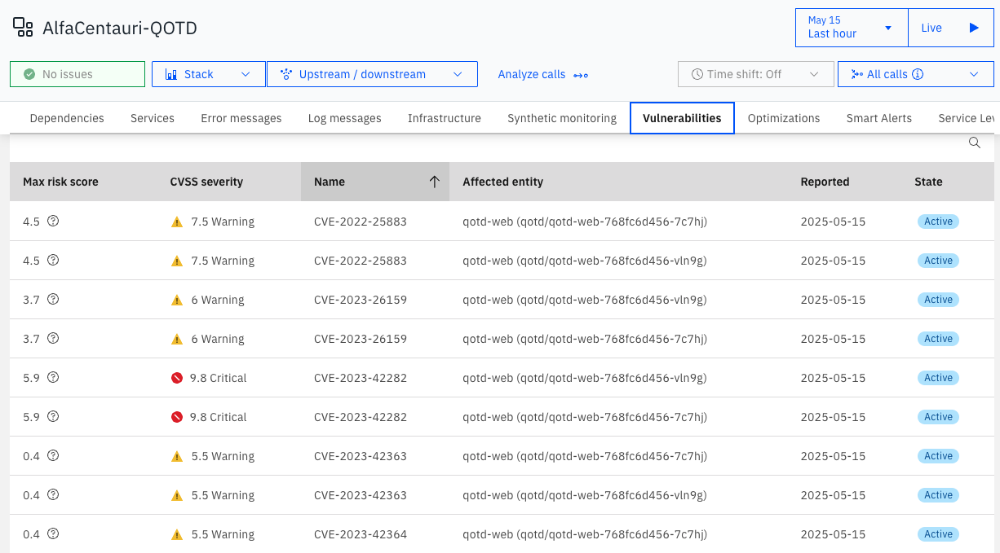

# IBM Instana and IBM Concert integration
{: .no_toc }

Technical guide on how to integrate the IBM Instana backend with IBM Concert, this approach is using IBM Instana SaaS, IBM Concert running on VM and a Demo application running on RedHat Openshift.
With some slight changes, it should work for other implementations.
{: .fs-6 .fw-300 }

Official documentation
Read both links before proceeding.

[From IBM Instana](https://www.ibm.com/docs/en/instana-observability/1.0.295?topic=apis-integrating-concert){: .btn .btn-primary .fs-5 .mb-4 .mb-md-0 .mr-2 }
[From IBM Concert](https://www.ibm.com/docs/en/concert?topic=connections-integrating-instana-observability){: .btn .fs-5 .mb-4 .mb-md-0 }

<details open markdown="block">
  <summary>
    Table of contents
  </summary>
  {: .text-delta }
1. TOC
{:toc}
</details>

---

## Purpose of this guide and pre-requisites

{: .important }
> The purpose is to teach you step-by-step how to integrate IBM Instana and IBM Concert (and a demo app on RedHat OpenShift).

{: .warning }
> Before starting, you should have admin access to both, Instana and Concert and admin access to the OpenShift server where the DEMO app will be installed.

## The meaning of this integration
If you read the documentation it may seem like you just need this integration to feed the data from Instana to Concert and to see the CVEs on Instana, but this is a bit more profound per say.

### You feed application definitions in Concert from Instana
Yes, with the integration "Instana to Concert" the application definitions will be populated automatically in Concert from the, please note, **Application Perspectives** found in Instana. Those are know as **application definitions** in Concert.
This mean that you don't need to create, build and apply SBOMs from your applications, all will be fed by Instana.

### You feed CVE information in Instana from Concert
On Instana in the application perspective, you're going to see a tab called Vulnerabilities, that is fed by the Instana agent configuration.

## Ingredients
A demo APP, we're going to use [QOTD from IBM](https://gitlab.com/quote-of-the-day).
Have an IBM Instana backend and an [IBM Instana API key](https://www.ibm.com/docs/en/instana-observability/1.0.295?topic=apis-instana-rest-api).
Have an IBM Concert instance and an [IBM Concert API key](https://www.ibm.com/docs/en/concert?topic=api-generating-key), note the "API key usage" section in the documentation, in this guide I'm using the `C_API_KEY` because I have a VM Concert deployment.

## QOTD IBM edition steps

This was quite a ride for me, but if you follow these steps, you're going to see everything you need in both, Instana and Concert and you can replicate the same for your applications and even you can use a Pipeline to automate all that, but, this is manual because I want to show you how that works.

### Install QOTD on Openshift

All steps to do that can be found in the [helm_deployment.md](https://gitlab.com/quote-of-the-day/quote-of-the-day/-/blob/master/helm_deployment.md) file but the quick guide is:

Create new projects `qotd` and `qotd-load`and apply policy:

```shell
oc new-project qotd
oc adm policy add-scc-to-user anyuid -z default

oc new-project qotd-load
oc adm policy add-scc-to-user anyuid -z default
```

We need the host, we can get that using this command:

```shell
oc get ingresses.config cluster -o yaml
```

The output should look like this:

```yaml
apiVersion: config.openshift.io/v1
kind: Ingress
metadata:
  creationTimestamp: "2025-05-13T08:02:43Z"
  generation: 1
  name: cluster
  resourceVersion: "33296"
  uid: 37310edf-d1cc-46d4-aefe-e180d612ecda
spec:
  domain: apps.myhost.com
```

Using the `spec.domain` value, install `qotd`

```shell
helm install qotd-chart qotd/qotd \
    --set enableInstana=true \
    --set host=apps.myhost.com
    --set branding="QotD - A demo app for Instana purposes"
```

You're going to get something like this on the shell:

```shell
The QotD application code is running in the qotd namespace.  The route
can be used to access the main application UI is

http://qotd-web-qotd.apps.myhost.com ; echo

The Load Generator and Anomaly Generator are deployed to the qotd-load namespace,
and can be accessed with

http://qotd-usecase-qotd-load.myhost.com
```

The Load Generator is really useful if you want to see things breaking up on Instana.

QOTD is installed on OpenShift!


## Create Code Scan SBOM, Image Scan SBOM and CVE Scan for QOTD-WEB

The application that we're going to use for this example is `qotd-web`, we need to clone the repository and run a few commands.

{: .important }
> You need to install `cdxgen`, `syft` and `trivy`. I'm on Mac and used `brew` to install these utilities.

Create a directory, something like `~/dev/ibm-concert/lab-qotd` and clone the repository:

```shell
git clone https://gitlab.com/quote-of-the-day/qotd-web.git
```

### Code Scan SBOM

```shell
pushd ~/dev/ibm-concert/lab-qotd/qotd-web
cdxgen -r -o ../codescan-cyclonedx-sbom.json --validate --spec-version 1.5
popd
```

### Image Scan SBOM

```shell
syft scan registry:registry.gitlab.com/quote-of-the-day/qotd-web:v5.1.0 -o cyclonedx-json@1.5 > imagescan-cyclonedx-sbom.json
```

### CVE Scan using Trivy

```shell
trivy image registry.gitlab.com/quote-of-the-day/qotd-web:v5.1.0 --format cyclonedx --scanners vuln -o cve-scan.json
```

Now we have three JSON files that you're going to need in the IBM Concert steps:

```shell
ls *.json
codescan-cyclonedx-sbom.json  cve-scan.json                 imagescan-cyclonedx-sbom.json
```

## IBM Instana steps

{: .important }
> Backend >= [Build 3.293](https://www.ibm.com/docs/en/instana-observability/current?topic=backend-build-3293) recommended.

### Install the Instana agent Operator

```shell
kubectl apply -f https://github.com/instana/instana-agent-operator/releases/latest/download/instana-agent-operator.yaml
```

### Create instana-agent-cr.yaml

```yaml
apiVersion: instana.io/v1
kind: InstanaAgent
metadata:
  name: instana-agent
  namespace: instana-agent
spec:
  zone:
    name: YourZone # (optional) name of the zone of the host
  cluster:
      name: ClusterNameSameAsOpenshift
  agent:
    key: SALESKEY
    downloadKey: DOWNLOADKEY
    endpointHost: INSTANAHOST
    endpointPort: "443"
    env: {}
    configuration_yaml: |
      com.instana.plugin.cve:
        enabled: true
        concert:
          base_url: 'https://YOURCONCERTINSTANCE'
          instance_id: 'CONCERT_INSTANCE_ID'
          api_key: 'CONCERT_API_KEY'
          poll_rate: 10
          ignore_cert: true
```

{: .important }
> `poll_rate` is in minutes.

{: .warning }
> Note the `ignore_cert` value, is not in the docs but I used that because I have a self-signed certificate. If you have a valid IBM Concert certificate then you can remove it.

Apply the agent configuration (asuming you used `oc login` already)

```shell
kubectl apply -f instana-agent-cr.yaml
```

{: .warning }
> Wait a few minutes and create an application perspective in Instana, please note down your application perspective name.

This is my configuration:


That's it, let's go to IBM Concert.

## IBM Concert steps

Here is where the fun begins... You need to perform a few steps to make this right.

### Create Instana connection

The documentation is pretty much straight-forward on this, if you follow that, you should have some like:


This is just to connect to the Instana instance, you need to create something that pulls the data out of Instana, let's create an ingestion job.

### Create Instana ingestion job

Again, the [documentation](https://www.ibm.com/docs/en/concert?topic=connections-integrating-instana-observability#integrating_with_instana__title__4) is straight-forward but I think it's missing some key aspects for your consideration before creating one ingesting job.

{: .warning }
> The ingesting job is going to retrieve the information from ALL application perspectives in Instana with live traffic in the last 7 days.

{: .warning }
> Always assign a target environment.


{: .warning }
> LIMITATION: There is no way to tell which applications we need, but work is in progress, thus we can't assign different environments using ingestion jobs from the same Instana connection.

{: .warning }
> LIMITATION: We can't delete a few or more application definitions on the UI, work in progress.

Once the ingestion job is created, just run it!


{: .important }
> PRO TIP: Don't reload the whole page, use the reload button next to "Create ingestion job" if you want to refresh the data inside Concert.

After running the ingestion job you're going to have ALL live Instana application perspectives in Concert, but.. I just need one.

### Extra step, leave AlfaCentari-QOTD only in Concert

For better demo purposes, I created a [shell script that can delete all application definitions](https://github.com/IsReal8a/concert-examples/blob/main/concert_api_delete_all_apps_definitions.sh) from Concert but just one, leaving AlfaCentauri-QOTD alone. If you want to use it, just change the script to match your values and you'll have just one application definition.

Run it and you're going to have just "your one and only" Application definition:


### Feed your QOTD application!

Go to "Inventory->Applications", click in your QOTD Application and go to the Overview tab:


You can see that I already fed the Source and Image SBOMs but lets feed the CVE, those go to Instana, click in "Upload vulnerability scan" and "drag and drop" the `cve-scan.json` file you created for QOTD.


Click the "Upload" button.

It's going to take a few seconds, just wait a bit and refresh the page.


Now we have the CVE trends!


And the CVEs linked to our application.

### Resilience

At the top click in "Administration->Settings->Miscellaneus" and enable resilience.


Before creating a posture plan, update the application, something like this:


**Creating a posture plan and an assessment**

Click at the top in "Dimensions->Resilience" and then the "Create posture plan" blue button in the lower right.


After creating the posture plan, click in the new posture plan, in my example, "QOTD at AlfaCentauri"

Click in the "Create assessment" blue botton at the bottom right of the screen, just input some values there that you may think can break the application and create the assessment.


You should have something like this:


Click on the `nfr_test_something...` at the bottom of the page and you should see something like this:


And that's it!

## More Screenshots

AlfaCentauri-QOTD Concert Topology


AlfaCentauri-QOTD Instana Vulnerabilities



Resilience overall potential disruption cost per hour

