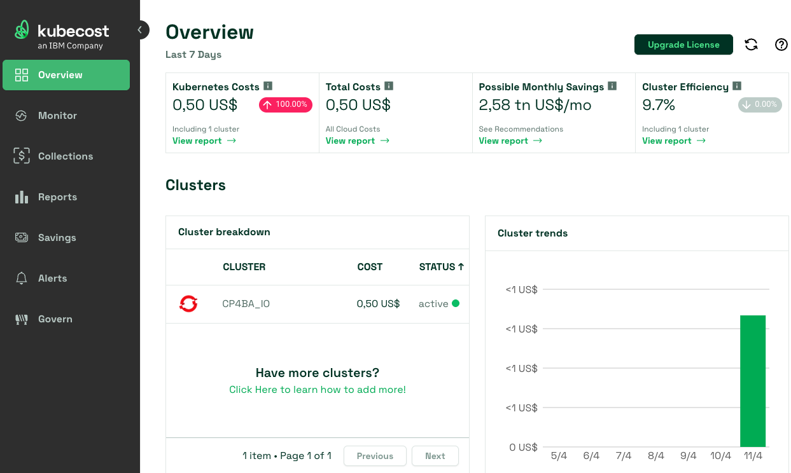

# IBM Instana and IBM Kubecost integration
{: .no_toc }

Technical guide on how to integrate IBM Instana with IBM Kubecost, this approach is using the Instana agent running in one RedHat OpenShift cluster and Kubecost free tier.
With some slight changes, it should work for other implementations but for RedHat OpenShift it was a bit harder than expected.

Updated: 5 May 2025
{: .fs-6 .fw-300 }

Official documentation

[From IBM Instana](https://www.ibm.com/docs/en/instana-observability/current?topic=apis-integrating-kubecost){: .btn .btn-primary .fs-5 .mb-4 .mb-md-0 .mr-2 }
[From IBM Kubecost](https://www.ibm.com/docs/en/kubecost/self-hosted/2.x?topic=installation){: .btn .fs-5 .mb-4 .mb-md-0 }

<details open markdown="block">
  <summary>
    Table of contents
  </summary>
  {: .text-delta }
1. TOC
{:toc}
</details>

---

## IBM KubeCost configuration
### Install/Upgrade KubeCost

You need to install IBM Kubecost on the same platform where you have the Instana agent running, this guide is going to help you integrate an Instana agent running in RedHat OpenShift.

If you subscribe to the IBM Kubecost Free tier then you will get this page:

[Install IBM KubeCost](https://www.kubecost.com/install#show-instructions){: .btn }

However, that may not be what you're looking for, because, you may have another provider like OpenShift:

[Provider Installations](https://www.ibm.com/docs/en/kubecost/self-hosted/2.x?topic=installation-provider-installations){: .btn }

I'm going to guide you how to install IBM Kubecost using the Standard deployment:

Read the below first to get familiar with the documentation:

[IBM Kubecost Standard deployment guide](https://www.ibm.com/docs/en/kubecost/self-hosted/2.x?topic=installations-install-kubecost-red-hat-openshift#standard-deployment-guide){: .btn }

In a host with connectivity to your OpenShift cluster (assuming you're logged-in), you need to run the following commands:

```shell
helm repo add kubecost https://kubecost.github.io/cost-analyzer/
helm repo update
```

Install IBM Kubecost on RedHat Openshift

{: .warning }
> It's imperative to install it with the same `clusterName` defined in the Instana agent configuration, for example, I defined the `clusterName` in Instana as `CP4BA_IO`, the same `clusterName` needs to be used in Kubecost.

> In the official documentation isn't clearly specify how to create a route for Kubecost, this will be needed for better integration, for that, I went into the depths and found a key that needs to be added in the helm command.

Use this yaml for route enabled, combination from [Openshift values](https://raw.githubusercontent.com/kubecost/cost-analyzer-helm-chart/v2.5/cost-analyzer/values-openshift.yaml) and [values](https://github.com/kubecost/cost-analyzer-helm-chart/blob/v2.6/cost-analyzer/values.yaml):

```yaml
# This Helm values file is a modified version of `values.yaml`.
# This file is meant to be used by users deploying Kubecost to OpenShift (OCP) clusters. For more configuration options, see `values.yaml`.
global:
  # Platforms is a higher-level abstraction for platform-specific values and settings.
  platforms:
    # Deploying to OpenShift (OCP) requires enabling this option.
    openshift:
      enabled: true  # Deploy Kubecost to OpenShift.
      route:
        enabled: true  # Create an OpenShift Route.
        annotations: { host: apps.example.ibm.com }  # Add annotations to the Route.
```

Save it as `values-openshift.yaml` and install it:

```shell
helm upgrade --install kubecost kubecost/cost-analyzer -n kubecost --create-namespace \
-f values-openshift.yaml \
--set kubecostProductConfigs.clusterName=CP4BA_IO \
--set prometheus.server.global.external_labels.cluster_id=CP4BA_IO
```

### How to access the IBM Kubecost UI

Open the route in the browser (You can find it in Networking->Routes on Openshift):

https://kubecost-cost-analyzer-route-kubecost.apps.example.ibm.com/overview



### Delete IBM Kubecost

Did you mess up somehow or don't need Kubecost anymore?

Delete IBM Kubecost!

```shell
helm uninstall kubecost -n kubecost
```

{: .important }
> If you want to crosscheck and see how to install Kubecost with self-signed certificates from Let's Encrypt, read Jignesh's contribution [HERE](https://github.com/IsReal8a/instana-examples/blob/main/contrib/kubecost_install_with_cert.md)

## IBM Instana configuration

Now that you have IBM Kubecost up and running you need to configure the Instana agent to communicate with Kubecost, you can go and use the official documentation but that doesn't work for RedHat OpenShift:

[Instana and Kubecost](https://www.ibm.com/docs/en/instana-observability/current?topic=apis-integrating-kubecost-public-preview){: .btn }

### Build your IBM Instana agent CR YAML and apply it

You need to push the new configuration to the Instana agent (or install it for first time if you haven't), remember the `clusterName` needs to be the same in both places, plus, you need to use the same name in the `clusters` value inside the Kubecost plugin, you can use the following Instana agent configuration as an example and modify it to match your values, pay attention to the `url` and the `port` in the configuration as this is the IP address and port I got from the previous section, if you don't do all this, you won't see a thing in the Instana UI:

```shell
apiVersion: instana.io/v1
kind: InstanaAgent
metadata:
  name: instana-agent
  namespace: instana-agent
spec:
  zone:
    name: DarkZone # (optional) name of the zone of the host
  cluster:
      name: CP4BA_IO
  agent:
    key: AGENT_KEY
    downloadKey: DOWNLOAD_KEY
    endpointHost: ingress-orange-saas.instana.io
    endpointPort: "443"
    env: {}
    configuration_yaml: |
      com.instana.plugin.kubecost:
        remote:
          - url: 'https://kubecost-cost-analyzer-route-kubecost.apps.example.ibm.com'
            poll_rate: 1800 # seconds
            clusters: #List of one or more k8s cluster names.
            - 'CP4BA_IO'
```

Save the file as `instana-agent-cr.yaml` and apply it:

```shell
kubectl apply -f instana-agent-cr.yaml
```

If everything went well, on the Instana UI, go to the left hand side menu, click "Platforms"-> "Kubernetes", search for your Cluster and at the end you're going to see the tab "Cost" click on it and you should have something similar as this:


If you do, that's it!

## Exploring uncharted territory

So far, with this installation, you get Prometheus and Grafana with KubeCost, but you may not need to access them... what if we use the Prometheus endpoints to send the data to Instana and then use the Instana UI for our purposes...
That's another chapter.