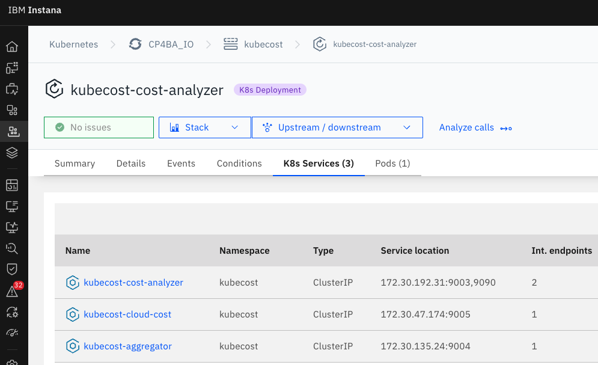

# IBM Instana and IBM Kubecost integration
{: .no_toc }

Technical guide on how to integrate IBM Instana with IBM Kubecost, this approach is using the Instana agent running in one RedHat OpenShift cluster and Kubecost free tier.
With some slight changes, it should work for other implementations but for RedHat OpenShift it was a bit harder than expected.
Latest revision to work with Kubecost version 2.8.4.

Updated: 24 November 2025
{: .fs-6 .fw-300 }

Official documentation

[From IBM Instana](https://www.ibm.com/docs/en/instana-observability/current?topic=apis-integrating-kubecost){: .btn .btn-primary .fs-5 .mb-4 .mb-md-0 .mr-2 }
[From IBM Kubecost](https://www.ibm.com/docs/en/kubecost/self-hosted/2.x?topic=installation){: .btn .fs-5 .mb-4 .mb-md-0 }

<details open markdown="block">
  <summary>
    Table of contents
  </summary>
  {: .text-delta }
1. TOC
{:toc}
</details>

---

## IBM Kubecost configuration
### Install IBM Kubecost

This guide is going to help you integrate an Instana agent running in RedHat OpenShift with Kubecost, on this guide both are running on the same cluster.

You can subscribe to the IBM Kubecost Free tier and start testing it:

[Install IBM Kubecost](https://www.apptio.com/products/kubecost/#kub-install){: .btn }

Note, the official documentation doesn't cover the following:

- It mentions version 2.5 and the latest version supported is 2.8.4.
- Version 2.9 is used for migration to version 3.0 only.

[Provider Installations](https://www.ibm.com/docs/en/kubecost/self-hosted/2.x?topic=installation-provider-installations){: .btn }

The following is to install IBM Kubecost version 2.8.0 (you can go to 2.8.4) using the Standard deployment, read the deployment guide first to get familiar with the documentation:

[IBM Kubecost Standard deployment guide](https://www.ibm.com/docs/en/kubecost/self-hosted/2.x?topic=installations-install-kubecost-red-hat-openshift#standard-deployment-guide){: .btn }

In a host with connectivity to your OpenShift cluster (assuming you're logged-in), you need to run the following commands:

```shell
helm repo add kubecost https://kubecost.github.io/cost-analyzer/
```
```shell
helm repo update
```

Install IBM Kubecost on RedHat Openshift

{: .warning }
> It's imperative to install it with the same `clusterName` defined in the Instana agent configuration, for example, I defined the `clusterName` in Instana as `AlfaCentauri`, the same `clusterName` needs to be used in Kubecost. At some point in some version there was a change that you required a `clusterID` now.

> In the official documentation isn't clearly specify how to create a route for Kubecost, this will be needed for better integration, for that, I went into the depths and found a key that needs to be added in the `Helm` command.

Use the YAML below for reference, combination from [Openshift values](https://raw.githubusercontent.com/kubecost/cost-analyzer-helm-chart/v2.8/cost-analyzer/values-openshift.yaml) and [general values](https://github.com/kubecost/cost-analyzer-helm-chart/blob/v2.8/cost-analyzer/values.yaml):

```yaml
# This Helm values file is a modified version of `values.yaml`.
# This file is meant to be used by users deploying Kubecost to OpenShift (OCP) clusters. For more configuration options, see `values.yaml`.
global:
  # Platforms is a higher-level abstraction for platform-specific values and settings.
  platforms:
    # Deploying to OpenShift (OCP) requires enabling this option.
    openshift:
      enabled: true  # Deploy Kubecost to OpenShift.
      route:
        enabled: true  # Create an OpenShift Route.
        annotations: { host: apps.example.ibm.com }  # Add annotations to the Route.
```

Save it as `values-openshift.yaml`.

{: .important }
> If you want to see how to install Kubecost with self-signed certificates from Let's Encrypt, read Jignesh's contribution [HERE](https://github.com/IsReal8a/instana-examples/blob/main/contrib/kubecost_install_with_cert.md)

Install Kubecost, I'm removing Grafana and using `values-openshift.yaml`:

```shell
helm upgrade --install kubecost kubecost/cost-analyzer -n kubecost --create-namespace --version 2.8.0 \
-f values-openshift.yaml \
  --set global.clusterId=AlfaCentauri \
  --set kubecostProductConfigs.clusterName=AlfaCentauri \
  --set prometheus.server.global.external_labels.cluster_id=AlfaCentauri \
  --set global.grafana.enabled=false \
  --set global.grafana.proxy=false
```

### How to access the IBM Kubecost UI

Open the route in the browser (You can find it in Networking->Routes on Openshift), since I followed the Letsencrypt guide I have one route like this:

https://kubecost.apps.example.ibm.com/overview


### Delete IBM Kubecost

Did you mess up somehow or don't need Kubecost anymore?

Delete IBM Kubecost!

```shell
helm uninstall kubecost -n kubecost
```

### Upgrade IBM Kubecost

In this guide I installed version 2.8.0 but the latest is 2.8.4 at the time of updating this guide, this is how you upgrade Kubecost:

```shell
helm upgrade kubecost kubecost/cost-analyzer -n kubecost --version 2.8.4
```

If everything went well, you should see something like:

```shell
Release "kubecost" has been upgraded. Happy Helming!
NAME: kubecost
LAST DEPLOYED: Mon Nov 24 13:37:41 2025
NAMESPACE: kubecost
STATUS: deployed
REVISION: 2
NOTES:
--------------------------------------------------
Kubecost 2.8.4 has been successfully installed.

Kubecost 2.x is a major upgrade from previous versions and includes major new features including a brand new API Backend. Please review the following documentation to ensure a smooth transition: https://www.ibm.com/docs/en/kubecost/self-hosted/2.x?topic=installation-kubecost-v2-installupgrade

When pods are Ready, you can enable port-forwarding with the following command:

    kubectl port-forward --namespace kubecost deployment/kubecost-cost-analyzer 9090

Then, navigate to http://localhost:9090 in a web browser.

Please allow 25 minutes for Kubecost to gather metrics. A progress indicator will appear at the top of the UI.

Having installation issues? View our Troubleshooting Guide at https://www.ibm.com/docs/en/kubecost/self-hosted/2.x?topic=troubleshoot-install
```

## IBM Instana configuration

Now that you have IBM Kubecost up and running you need to configure the Instana agent to communicate with Kubecost, you can go and use the official documentation but we need to make it work for RedHat OpenShift:

[Instana and Kubecost](https://www.ibm.com/docs/en/instana-observability/current?topic=apis-integrating-kubecost-public-preview){: .btn }

### Build your IBM Instana agent CR YAML and apply it

You need to push the new configuration to the Instana agent (or install it for first time if you haven't), remember the `clusterName` needs to be the same in both places, plus, you need to use the same name in the `clusters` value inside the Kubecost plugin, you can use the following Instana agent configuration as an example and modify it to match your values, pay attention to the `url` and the `port` in the configuration as this is the IP address and port I got from the previous section, if you don't do all this, you won't see a thing in the Instana UI.

I installed the agent using the Operator:

```shell
oc apply -f https://github.com/instana/instana-agent-operator/releases/latest/download/instana-agent-operator.yaml
```

Then, I used the following YAML for my Instana Agent CR:

```shell
apiVersion: instana.io/v1
kind: InstanaAgent
metadata:
  name: instana-agent
  namespace: instana-agent
spec:
  zone:
    name: DarkZone
  cluster:
      name: AlfaCentauri
  agent:
    key: key
    downloadKey: key
    endpointHost: ingress-red-saas.instana.io
    endpointPort: "443"
    env: {}
    configuration_yaml: |
      com.instana.plugin.kubecost:
        remote:
          - url: 'https://kubecost.apps.example.ibm.com'
            poll_rate: 1800
            clusters:
            - 'AlfaCentauri'
```

Save the file as `instana-agent-cr.yaml` and apply it:

```shell
oc apply -f instana-agent-cr.yaml
```

Verify all your pods are up and running:

```shell
oc get pods -n instana-agent -w
```

Check your logs and see if you don't have any kubecost issues:

```shell
oc logs -n instana-agent -l app.kubernetes.io/name=instana-agent --tail=200 | grep -i kubecost
```

If everything went well, on the Instana UI, go to the left hand side menu, click "Platforms"-> "Kubernetes", search for your Cluster, click on it, you're going to see the tabs just go at the end of them and you're going to see the "Cost" tab, click on it and you should have something like this:



If you do, that's it!
