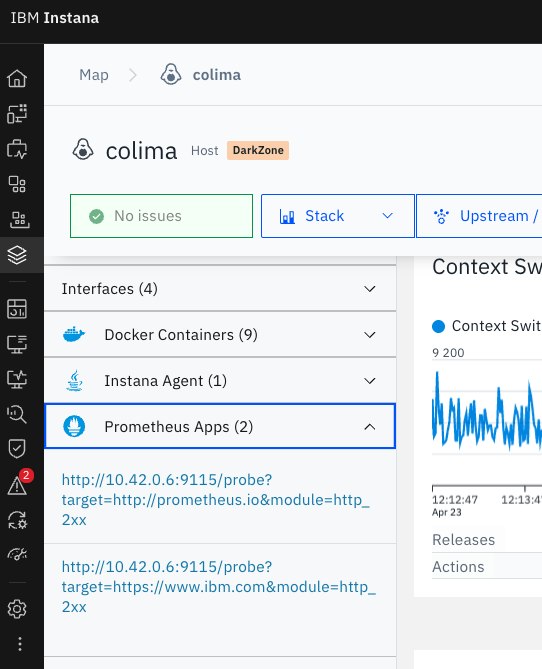

# Monitor HTTP webpages using Prometheus Blackbox exporter
{: .no_toc }

Technical guide on how to monitor HTTP webpages using Prometheus blackbox exporter.
{: .fs-6 .fw-300 }

Instana official documentation about Prometheus

[From Instana](https://www.ibm.com/docs/en/instana-observability/current?topic=apis-prometheus){: .btn .btn-primary .fs-5 .mb-4 .mb-md-0 .mr-2 }

## Pre-requisites

{: .warning }
> It's important to note that you will NOT need a Prometheus server for this approach, the Instana agent does the Prometheus metrics scrapping.

The following setup is done using a mini Kubernetes "Cluster" as "Probe", you can use an Instana Synthetic PoP or even [a blackbox exporter docker image](https://github.com/prometheus/blackbox_exporter?tab=readme-ov-file#using-the-docker-image) to get the same results but the last one requires more work.

## Ingredients used

* A Kubernetes cluster with Internet access and admin rights.
* An Instana backend with permissions to install Instana agents.

## Prometheus Blackbox exporter

First, you need to construct a `pbe_values.yaml` file, for more information about it, you can read the [Prometheus blackbox exporter official documentation](https://github.com/prometheus/blackbox_exporter).

Here is an example that can work:

```yaml
config:
  modules:
    http_2xx:
      prober: http
      timeout: 5s
      http:
        valid_http_versions: ["HTTP/1.1", "HTTP/2.0"]
        follow_redirects: true
        preferred_ip_protocol: "ip4"
```

Save it as `pbe_values.yaml` and install the blackbox exporter into your Kubernetes cluster.

### Install Prometheus Blackbox exporter

```shell
helm install prometheus-blackbox prometheus-community/prometheus-blackbox-exporter -f pbe_values.yaml
```

To make sure we installed the blackbox exporter without issues we need to make sure it's up and running.

### Export Pod Name

```shell
export POD_NAME=$(kubectl get pods --namespace default -l "app.kubernetes.io/name=prometheus-blackbox-exporter,app.kubernetes.io/instance=prometheus-blackbox" -o jsonpath="{.items[0].metadata.name}")
```

### Export Container Port

```shell
export CONTAINER_PORT=$(kubectl get pod --namespace default $POD_NAME -o jsonpath="{.spec.containers[0].ports[0].containerPort}")
```

### Forward port to our localhost

```shell
kubectl --namespace default port-forward $POD_NAME 8080:$CONTAINER_PORT
```

### Look for the Blackbox exporter

Open [Localhost](http://localhost:8080/)

If everything went well, you will see something like this:


## Instana agent

Now that the Blackbox exporter is installed, it can receive requests from any software, the usual way is using the Prometheus server to call the Blackbox exporter and save the results in Prometheus. However, we'll skip the Prometheus server step and use the Instana agent and backend instead.

### Install the Instana agent

Do it, in case you haven't :) 

### Configure the Instana agent CR file

After some debugging, I found out the correct way to setup the Prometheus plugin in the Instana agent to work with the Blackbox exporter, I got some ideas from the [official Prometheus documentation](https://prometheus.io/docs/guides/multi-target-exporter/)

The Blackbox exporter expose a `/probe` endpoint but it can't be scrapped neither by Prometheus or Instana without using the right `target`, so, I ended up using an url like this:

```shell
/probe?target=http://prometheus.io&module=http_2xx
```

My `instana-agent-cr.yaml` file looks like this:

```yaml
apiVersion: instana.io/v1
kind: InstanaAgent
metadata:
  name: instana-agent
  namespace: instana-agent
spec:
  zone:
    name: DarkZone # (optional) name of the zone of the host
  cluster:
    name: MacOSwithCheese
  agent:
    key: AGENT_KEY
    downloadKey: DOWNLOAD_KEY
    endpointHost: ingress-orange-saas.instana.io
    endpointPort: "443"
    env: {}
    configuration_yaml: |
      com.instana.plugin.prometheus:
        poll_rate: 60
        podConnectTimeout: 750
        podReadTimeout: 2500
        customMetricSources:
        - url: '/probe?target=http://prometheus.io&module=http_2xx'
          metricNameIncludeRegex: '^.'
        - url: '/probe?target=https://www.ibm.com&module=http_2xx'
          metricNameIncludeRegex: '^.'
```

Now you can apply it to your Kubernetes cluster:

```shell
kubectl apply -f instana-agent-cr.yaml
```

Wait a few minutes and go to the Instana UI, Infrastructure -> your Kubernetes cluster and select one of the hosts, you should have a Prometheus App there, like this:



And some metrics


## Dashboards

Yes, you can create your own dashboards and alerts, but we're limited by a few things on the Instana side, I even created one idea [INSTANA-I-3550](https://automation-management.ideas.ibm.com/ideas/INSTANA-I-3550) and some of the metrics will not work as we expect, but, it's something.

### Instana dashboard


### Grafana dashboard


## Next Steps

Create Smart Alerts and refine the dashboards (if possible) and share them.