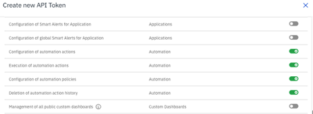
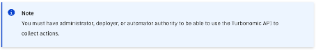
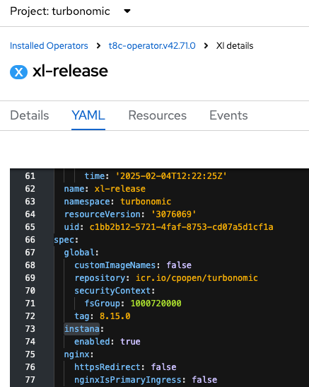
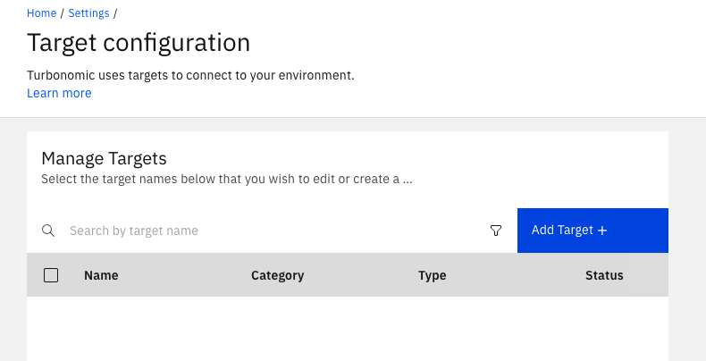
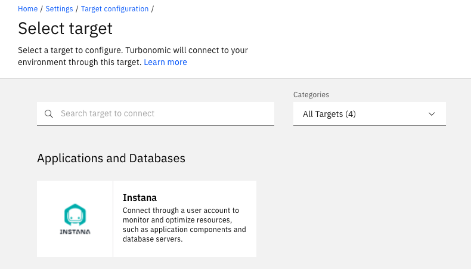
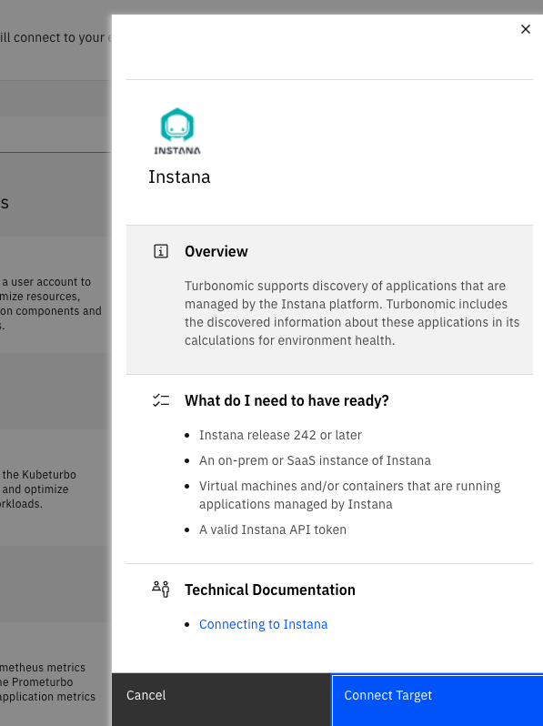
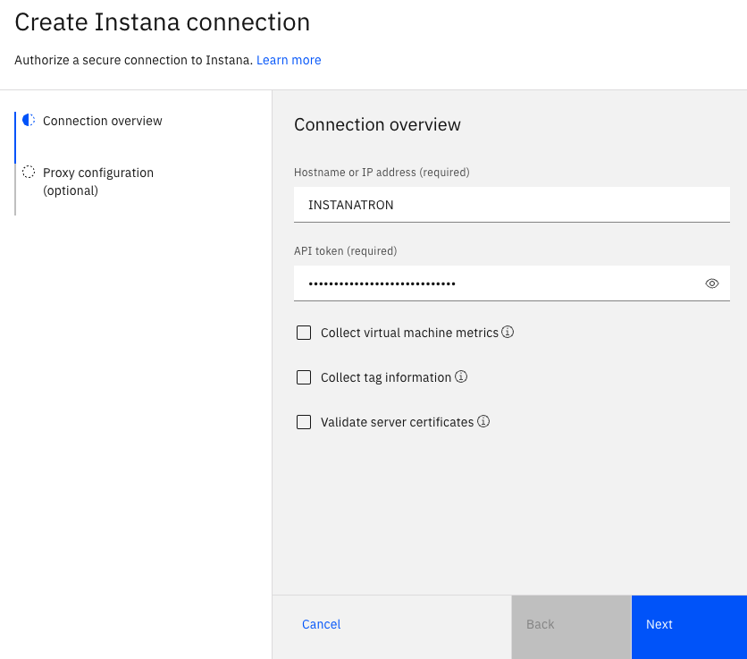
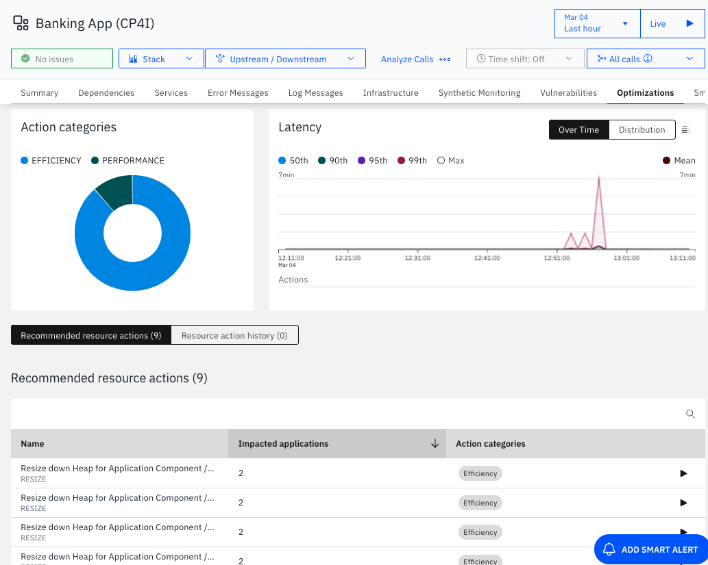
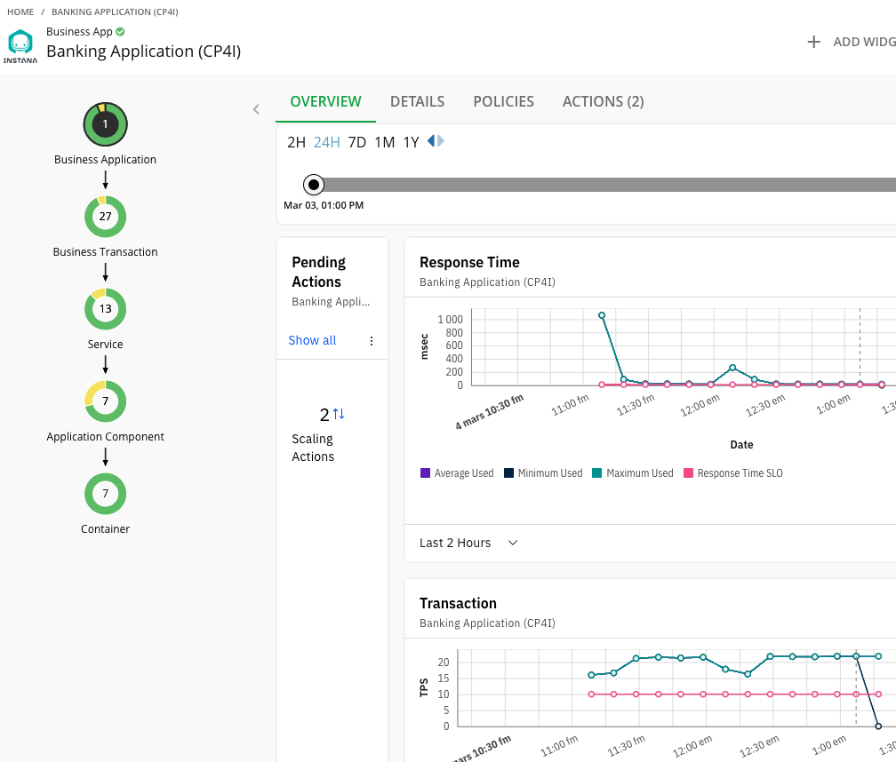

# IBM Instana and IBM Turbonomic integration
{: .no_toc }

Technical guide on how to integrate the IBM Instana backend with IBM Turbonomic, this approach is using IBM Instana Self-hosted Standard single-node and IBM Turbonomic running in RedHat Openshift.
With some slight changes, it should work for other implementations.
{: .fs-6 .fw-300 }

Official documentation

[From IBM Instana](https://www.ibm.com/docs/en/instana-observability/current?topic=apis-integrating-turbonomic){: .btn .btn-primary .fs-5 .mb-4 .mb-md-0 .mr-2 }
[From IBM Turbonomic](https://www.ibm.com/docs/en/tarm/8.15.2?topic=targets-instana){: .btn .fs-5 .mb-4 .mb-md-0 }

<details open markdown="block">
  <summary>
    Table of contents
  </summary>
  {: .text-delta }
1. TOC
{:toc}
</details>

---

## Purpose of this guide and pre-requisites

{: .important }
> The purpose is to teach you step-by-step how to integrate IBM Instana (Self-hosted) single-node and IBM Turbonomic (on RedHat OpenShift).

{: .warning }
> Before starting, you should have admin access to both, Instana and Turbonomic, been able to establish a SSH connection to the Instana backend and access to the OpenShift server where Turbonomic is running, at least using CLI but UI is preferred.

## Configuration on IBM Instana

{: .important }
> Standard backend >= 1.8.0 recommended.

### Enable the Automation feature

For reference:

[Enable optional features - Automation](https://www.ibm.com/docs/en/instana-observability/current?topic=configuring-enabling-optional-features#automation-framework){: .btn }

Connect to your Instana backend and run the following command:

```shell
stanctl backend apply --core-feature-flags feature.automation.enabled=true
```

### Create an API Key

Go to Settings -> "Security & Access" -> "API Tokens" and click in "New API Token"

Name it `Turbonomic` and select all Automation permissions.



{: .warning }
> If you don't see the Automation permissions, you need to refresh the page or logout-login Instana.

### Enable the Optimization feature

This will show you the "Optimization Tabs" in the Applications inside Instana. Connect to your Instana backend and run the following command:

```shell
stanctl backend apply --core-feature-flags feature.resource.optimization.actions.enabled=true
```

### Enabling the IBM Turbonomic sensor on IBM Instana

Instana collects Turbonomic action information using the Turbonomic Sensor. This sensor collects the action data by using the Turbonomic REST APIs. By default, the Turbonomic sensor is disabled. To enable and configure the sensor, update the Instana agent configuration file as shown in the following example:

```yaml
# Turbonomic Sensor
com.instana.plugin.turbonomic:
 enabled: true
 host: '<INSERT_TURBONOMIC_SERVER_HERE>'  # Turbonomic Server Host or IP address in https://x.x.x.x format
 target: '<INSERT_TURBONOMIC_TARGET_NAME>' # Name of the target (Instana Server) as configured in Turbonomic
 auth:
   username: <INSERT_USERNAME_OF_TURBONOMIC_SERVER_HERE>  # User must have administrator, deployer, or automator authority.
   password: <INSERT_PASSWORD_OF_TURBONOMIC_SERVER_HERE>
```

{: .warning }
> Careful! the Target name needs to be the same as the Target in Turbonomic, for example, I used "INSTANATRON" in Instana, that should be the Target in Turbonomic.
> You can remove the comments for better visibility, one test was made making the changes in a ConfigMap in OpenShift and the comments where causing issues with the YAML.

From the Turbonomic documentation, these are the considerations when adding the username in the Turbonomic sensor configuration:



You should have something like this for `agent-configuration.yaml`

```yaml
# Turbonomic Sensor
com.instana.plugin.turbonomic:
 enabled: true
 host: 'MYTURBONOMICHOST'  # Turbonomic Server Host or IP address
 target: 'INSTANATRON' # Name of the target (Instana Server) as configured in Turbonomic
 auth:
   username: MYUSER  # User must have administrator, deployer, or automator authority. 
   password: MYPASSWORD
```

If you're using HELM, you can run something like this to update the Instana agent, make the necessary changes based on your Instana configuration/deployment.
In this example, the Instana agent was already deployed in a RedHat OpenShift cluster using HELM.

```shell
helm pull --repo https://agents.instana.io/helm --untar instana-agent && oc apply -f instana-agent/crds; helm upgrade --namespace instana-agent instana-agent \
--repo https://agents.instana.io/helm instana-agent \
--set-file agent.configuration_yaml=agent-configuration.yaml \
--reuse-values
```

For the IBM Instana Operator, maybe something like this:

```yaml
apiVersion: instana.io/v1
kind: InstanaAgent
metadata:
  name: instana-agent
  namespace: instana-agent
spec:
  zone:
   name: DarkZone # (optional) name of the zone of the host
  cluster:
   name: MacOSwithCheese
  agent:
   key: SALES_KEY
   downloadKey: DOWNLOAD_KEY
   endpointHost: somehost.instana.ibm.com
   endpointPort: "443"
   env: {}
   configuration_yaml: |
    # You can leave this empty, or use this to configure your instana agent.
    # See https://ibm.biz/K8s-agent-administer
    # Turbonomic Sensor
    com.instana.plugin.turbonomic:
     enabled: true
     host: 'MYTURBONOMICHOST'  # Turbonomic Server Host or IP address
     target: 'INSTANATRON' # Name of the target (Instana Server) as configured in Turbonomic
     auth:
      username: MYUSER  # User must have administrator, deployer, or automator authority. 
      password: MYPASSWORD
```

Save it as `instana-agent-crd.yaml`

Deploy the yaml

```shell
kubectl apply -f instana-agent-crd.yaml
```

More information about the Instana agent in RedHat OpenShift:

[Instana agent OCP](https://www.ibm.com/docs/en/instana-observability/current?topic=openshift-administering-agent-red-hat#configuring-the-agent){: .btn .btn-blue}

## Configuration on IBM Turbonomic

In the official documentation it's mentioned that you need to add an Instana target but that **IS NOT** enabled by default in the Turbonomic Targets, you need to enable targets when needed, and for that is a complete path by it's own, after researching, all information can be found when creating an instance here:

[Install Targets](https://www.ibm.com/docs/en/tarm/8.15.2?topic=cluster-installing-red-hat-openshift-using-operatorhub#WebConsole_OpShft__install_targets){: .btn }

{: .important-title }
> From the Docs
>
> When you first install Turbonomic using OperatorHub, target probes are disabled by default. Enable desired target probes, such as IaaS types whether on-prem or cloud.
>
> A probe is a platform component that connects to a target. It discovers the target's entities and loads them into the Turbonomic supply chain, where actions can be executed on entities within the target environment. Turbonomic ships with many probe components that you can use to connect Turbonomic with your environment.

### Enabling the IBM Instana Target

For that, in RedHat OpenShift, navigate to Operators -> Installed Operators -> Turbonomic Platform Operator -> Turbonomic Platform Operator tab -> xl-release.

Go to the YAML tab and add the Instana target in the `spec: section`, just after global:

```yaml
spec:
  global:
    customImageNames: false
    repository: icr.io/cpopen/turbonomic
    securityContext:
      fsGroup: 1000720000
    tag: 8.15.0
  instana:
    enabled: true
```

Example



Save and reload

{: .important }
> To validate the change, go to Workloads -> Pods and confirm all pods are running and ready, this may take a few minutes.

### Adding the IBM Instana Target in the UI

Once installed, then you can go to the Turbonomic UI, Settings -> Target Configuration, click the button "Add Target" and you should have the Instana Target.





Click on Connect Target:



Add all information from your Instana configuration we setup at the beginning of this guide:

{: .warning }
> Remember to use the same Target name as the Instana - Turbonomic sensor.



Read the rest of the options and see if they apply to you, add a Proxy if needed and just click Add.

If everything went well, you should have a new Instana Target!

## IBM Instana and IBM Turbonomic look and feel

Now that the integration was configured, you should see the Application Perspectives (Business Applications) in Turbonomic and the Turbonomic information in the Optimizations tab in the Application Perspective in Instana.

For example, "Bank Application (CP4I)"

### On IBM Instana



### On IBM Turbonomic



And that's it! hope you found this guide useful.