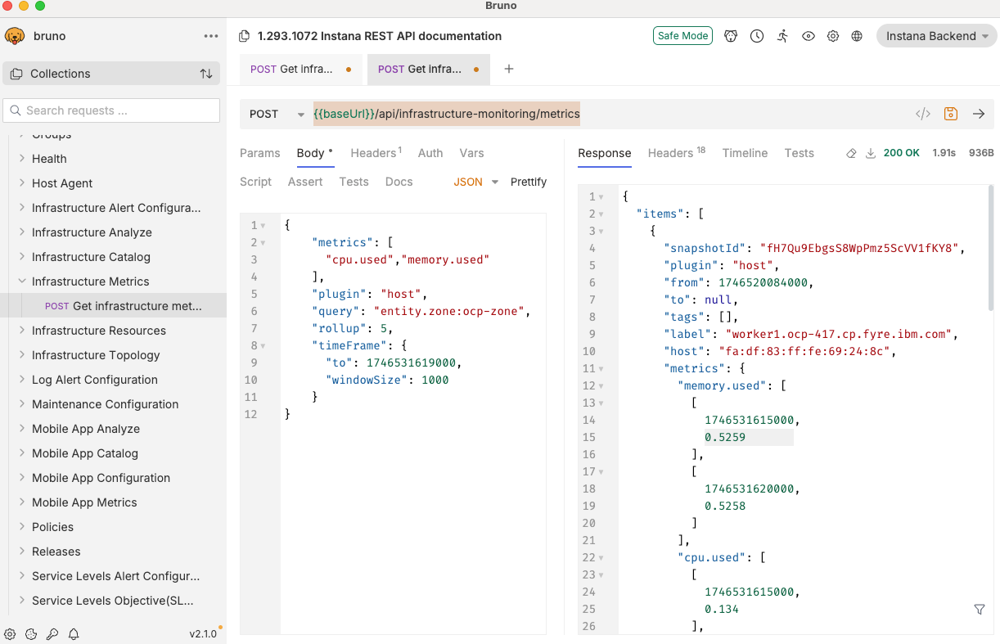
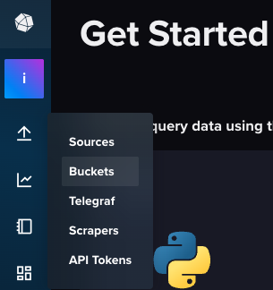
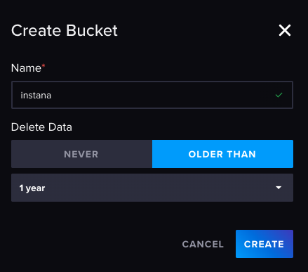
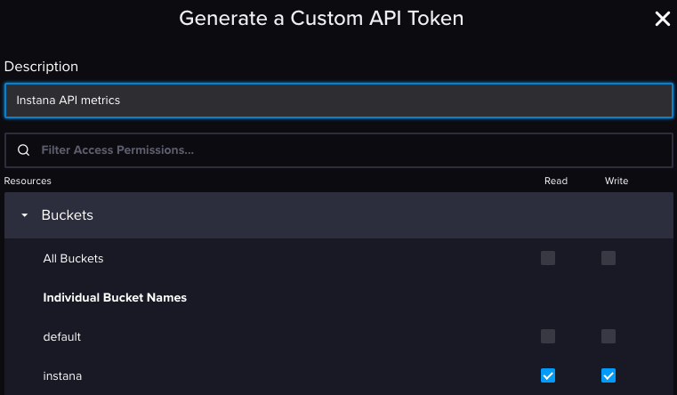
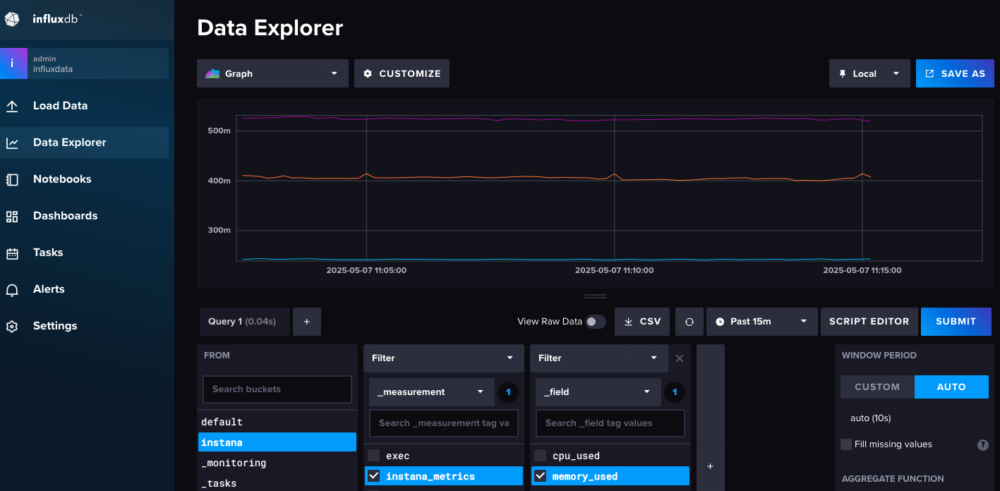
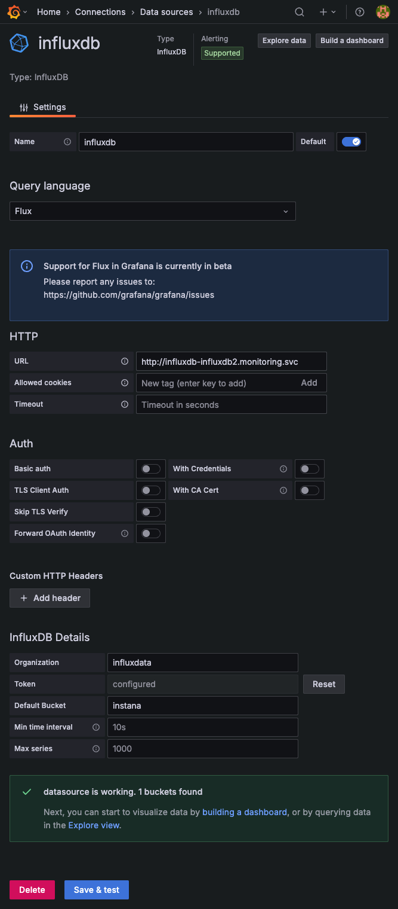
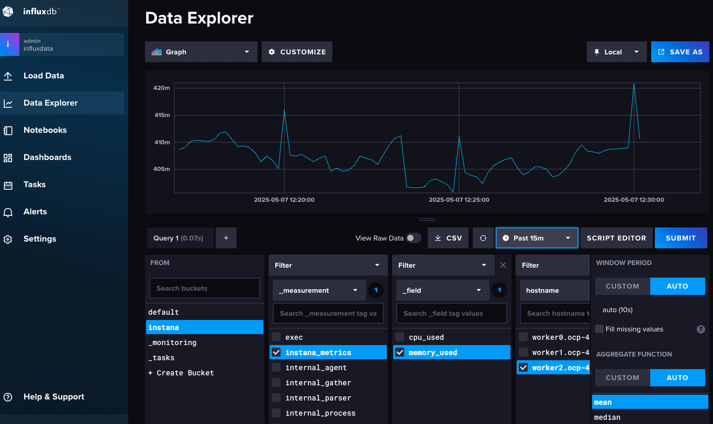
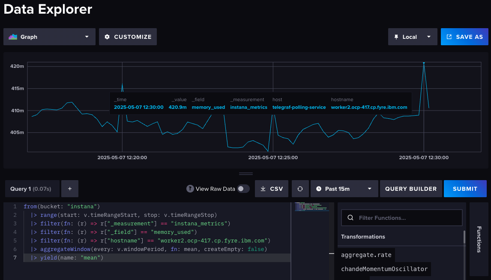
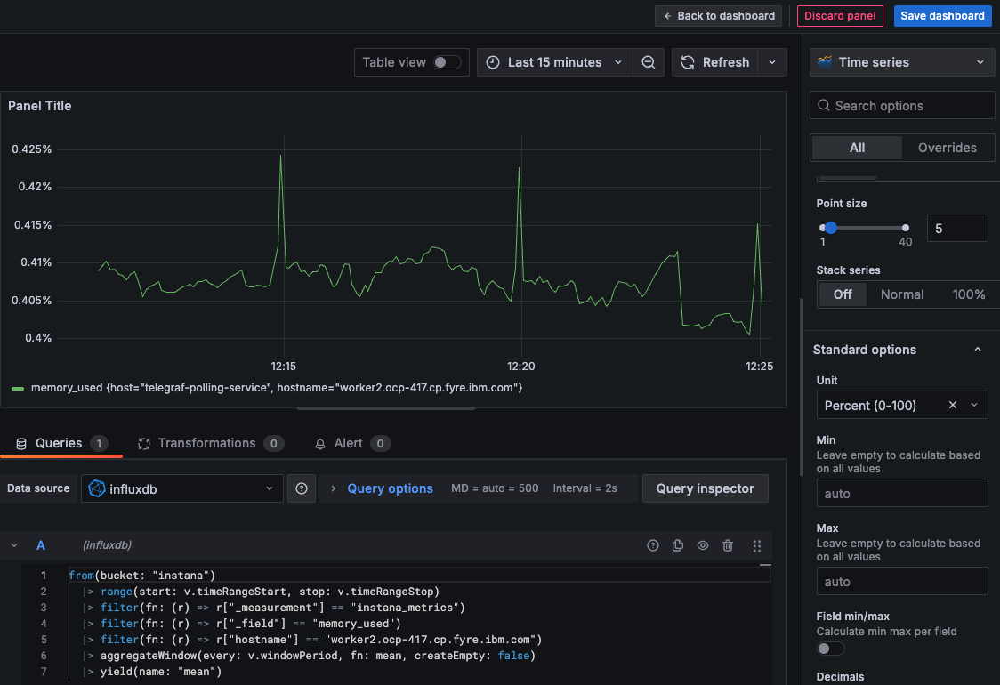
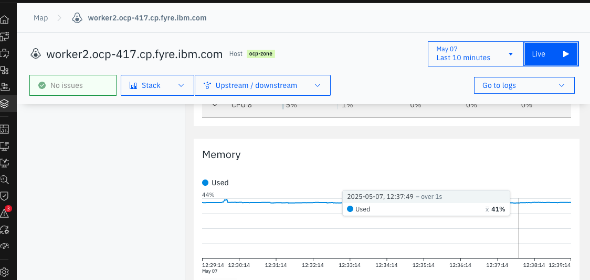

# Export IBM Instana infrastructure metrics to InfluxDB
{: .no_toc }

Technical guide on how to export IBM Instana metrics to InfluxDB for long term storage and historical purposes. The customers' main use case is that they need to have metrics available from their environments (specially CPU and MEM usage) from the last six months or even years back, this retention is not possible on Instana.
{: .fs-6 .fw-300 }

<details open markdown="block">
  <summary>
    Table of contents
  </summary>
  {: .text-delta }
1. TOC
{:toc}
</details>

---

## Purpose of this guide and pre-requisites

The purpose is to teach you step-by-step, using an example, how automatically import metrics from IBM Instana (API) to InfluxDB and then visualize the data in Grafana.

Since we're going to use the Instana API, this guide works for SaaS and Self-hosted backends. The entire exercise was done against an Instana SaaS instance.

{: .warning }
> Yes, I know we have some [Data retention policy](https://www.ibm.com/docs/en/instana-observability/current?topic=policies#data-retention-policy) and should be enough, but as mentioned before, some customers need more flexibility because their regulations and internal requirements.
> In this guide, I'm using InfluxDB, Telegraf and Grafana running in a small Kubernetes cluster, you can architect the solution the way you need but the main goal of this guide is to show you how certain parts are done.

{: .important }
> So far, this has been one of the most challenging use cases brought up by the customers, not for the need, it's because not straight-forward information when you read the documentation in several places, and you know it, I don't stop until I have a solution, maybe I'm used to the pain and suffering.

{: .important }
> Standard backend >= 1.8.0 recommended.

## Ingredients

Since this is something that needs some creativity, you need at least:

* 1 Kubernetes cluster (I used Colima in MacOS).
* 1 Instana backend with an API key/token to read Infrastructure metrics. Read more at [Instana REST API](https://www.ibm.com/docs/en/instana-observability/current?topic=apis-instana-rest-api)
* Basic Kubernetes management, APIs and shell scripting.
* Patience.

## Important

{: .warning }
> Please read the entire document with patience and prepare everything before you move on, most of this is based on my tests and it works (in my computer), maybe it can be improved, if you see something, say something, tell me what needs to be improved.
> There is no out-of-the-box tool that can help us to get the data from the Instana API and then store it somewhere else, and you need to know exactly where and how I'm getting the metrics from Instana.

## API steps

### Instana OpenAPI

The place where we can find the CPU and MEM infrastructure metrics from the Instana API is [Get Infrastructure Metrics](https://instana.github.io/openapi/#operation/getInfrastructureMetrics).

I suggest to use an API client like Bruno to create your payload and run requests first, that way you know what you're getting from Instana. This is a screenshot from the main request I used to get the metrics, I'm sure the JSON payload is the correct:



## Kubernetes steps

### Create the monitoring namespace

We need at least make things a bit clean and in order, for that purpose, create a namespace called `monitoring` where you will have all monitoring tools (InfluxDB, Telegraf and Grafana) running in Kubernetes.

```shell
kubectl create namespace monitoring
```

## InfluxDB steps

Add the Influxdata repo:

```shell
helm repo add influxdata https://helm.influxdata.com/
```

I'm using this `influxdb-values.yaml` for persistence, save it in the directory you're working on:

```yaml
persistence:
  enabled: true
  ## If true will use an existing PVC instead of creating one
  # useExisting: false
  ## Name of existing PVC to be used in the influx deployment
  # name:
  ## influxdb data Persistent Volume Storage Class
  ## If defined, storageClassName: <storageClass>
  ## If set to "-", storageClassName: "", which disables dynamic provisioning
  ## If undefined (the default) or set to null, no storageClassName spec is
  ##   set, choosing the default provisioner.  (gp2 on AWS, standard on
  ##   GKE, AWS & OpenStack)
  ##
  # storageClass: "-"
  accessMode: ReadWriteOnce
  size: 5Gi
  mountPath: /var/lib/influxdb2
  subPath: ""
```

Install InfluxDB with the `influxdb-values.yaml` file, I'm using version 2 in this guide.

```shell
helm upgrade --install influxdb influxdata/influxdb2 -n monitoring -f influxdb-values.yaml
```

You can extract the `admin` password with this command:

```shell
echo $(kubectl get secret influxdb-influxdb2-auth -o "jsonpath={.data['admin-password']}" --namespace monitoring | base64 --decode)
```

Do a port forwarding for InfluxDB

```shell
kubectl port-forward pods/influxdb-influxdb2-0 8086:8086 -n monitoring
```

Open the InfluxDB UI at [http://localhost:8086](http://localhost:8086)

Access to UI and Configure a Bucket

Click in the "UP arrow" in the left hand side menu and click "Buckets"



Click the "Create Bucket" button and create your bucket, you should read more about that on the InfluxDB documentation so you can make the right decisions when creating the bucket.



On the same page, there is a tab called "API tokens", click it.
Click the "API token" button and click "Custom API token".

Enter a description and select Read and Write:



Click the "Generate" button.
Save the token somewhere safe and that's it for now.

## Telegraf steps

{: .important }
Before continuing, you need to have your `INSTANA_API_TOKEN` and `INFLUXDB_TOKEN` ready.

I know this whole guide is an example, but since we started to make things nice and clean we're going to use some secrets, that way our sensitive information is not available just because.
We're going to need a `telegraf-secrets.yaml`, `telegraf-values.yaml` and `get_instana_metrics.sh` files.

{: .warning }
> Please put special attention to the `config.agent.interval` (seconds/minutes) value inside `telegraf-values.yaml` as needs to be the same timeframe used in the `windowSize` value used in the `--post-data` part inside the `get_instana_metrics.sh` script. I know, too much gibberish.

{: .warning }
> In this example, I use 5m (minutes) for the Telegraf agent interval and 300000 (milliseconds) for the shell script.
> You may ask, why is this important? because we don't want to hammer the Instana API with too much API requests, instead, the whole process in this example gets metrics each 5 minutes as **this is for testing purposes**, my suggestion for a **production** approach, is to **change the interval to at least 30 minutes** in both `config.agent.interval` and `windowSize`, all values obtained from the API are backfilled without problems into InfluxDB.

`telegraf-secrets.yaml`

```yaml
apiVersion: v1
kind: Secret
metadata:
  name: telegraf-secrets
type: Opaque
stringData:
  INFLUXDB_URL: http://influxdb-influxdb2.monitoring.svc
  INFLUXDB_TOKEN: YOURTOKENFROMINFLUXDB
  INFLUXDB_ORG: influxdata
  INFLUXDB_BUCKET: instana
  INSTANA_API_URL: https://YOURINSTANAUNITTENANT
  INSTANA_API_TOKEN: YOURINSTANAAPITOKEN
```

`telegraf-values.yaml`

```yaml
## Default values.yaml for Telegraf
## This is a YAML-formatted file.
## ref: https://hub.docker.com/r/library/telegraf/tags/

replicaCount: 1
image:
  repo: "docker.io/library/telegraf"
  tag: "1.34-alpine"
  pullPolicy: IfNotPresent
podAnnotations: {}
podLabels: {}
imagePullSecrets: []
## Configure args passed to Telegraf containers
args: []
# The name of a secret in the same kubernetes namespace which contains values to
# be added to the environment (must be manually created)
# This can be useful for auth tokens, etc.

envFromSecret: "telegraf-secrets"
env:
  - name: HOSTNAME
    value: "telegraf-polling-service"
# An older "volumeMounts" key was previously added which will likely
# NOT WORK as you expect. Please use this newer configuration.

volumes:
  - name: instana-script
    configMap:
      name: instana-script
      defaultMode: 0755

mountPoints:
  - name: instana-script
    mountPath: /scripts
    readOnly: true

# volumes:
# - name: telegraf-output-influxdb2
#   configMap:
#     name: "telegraf-output-influxdb2"
# mountPoints:
# - name: telegraf-output-influxdb2
#   mountPath: /etc/telegraf/conf.d
#   subPath: influxdb2.conf

## Configure resource requests and limits
## ref: http://kubernetes.io/docs/user-guide/compute-resources/
resources: {}
# requests:
#   memory: 128Mi
#   cpu: 100m
# limits:
#   memory: 128Mi
#   cpu: 100m

## Node labels for pod assignment
## ref: https://kubernetes.io/docs/user-guide/node-selection/
nodeSelector: {}
## Affinity for pod assignment
## Ref: https://kubernetes.io/docs/concepts/configuration/assign-pod-node/#affinity-and-anti-affinity
##
affinity: {}
## Tolerations for pod assignment
## Ref: https://kubernetes.io/docs/concepts/configuration/taint-and-toleration/
##
tolerations: []
# - key: "key"
#   operator: "Equal|Exists"
#   value: "value"
#   effect: "NoSchedule|PreferNoSchedule|NoExecute(1.6 only)"

## Configure the updateStrategy used to replace Telegraf Pods
## See https://kubernetes.io/docs/reference/kubernetes-api/workload-resources/deployment-v1/
updateStrategy: {}
#  type: RollingUpdate|Recreate
#  rollingUpdate:
#    maxUnavailable: 1
#    maxSurge: 1

service:
  enabled: true
  type: ClusterIP
  annotations: {}
rbac:
  # Specifies whether RBAC resources should be created
  create: true
  # Create only for the release namespace or cluster wide (Role vs ClusterRole)
  clusterWide: false
  # Rules for the created rule
  rules: []
# When using the prometheus input to scrape all pods you need extra rules set to the ClusterRole to be
# able to scan the pods for scraping labels. The following rules have been taken from:
# https://github.com/helm/charts/blob/master/stable/prometheus/templates/server-clusterrole.yaml#L8-L46
#    - apiGroups:
#        - ""
#      resources:
#        - nodes
#        - nodes/proxy
#        - nodes/metrics
#        - services
#        - endpoints
#        - pods
#        - ingresses
#        - configmaps
#      verbs:
#        - get
#        - list
#        - watch
#    - apiGroups:
#        - "extensions"
#      resources:
#        - ingresses/status
#        - ingresses
#      verbs:
#        - get
#        - list
#        - watch
#    - nonResourceURLs:
#        - "/metrics"
#      verbs:
#        - get

serviceAccount:
  # Specifies whether a ServiceAccount should be created
  create: true
  # The name of the ServiceAccount to use.
  # If not set and create is true, a name is generated using the fullname template
  name:
  # Annotations for the ServiceAccount
  annotations: {}
## Exposed telegraf configuration
## For full list of possible values see `/docs/all-config-values.yaml` and `/docs/all-config-values.toml`
## ref: https://docs.influxdata.com/telegraf/v1.1/administration/configuration/
config:
  agent:
    #interval: "60s"
    interval: "5m"
    round_interval: true
    metric_batch_size: 1000
    metric_buffer_limit: 10000
    collection_jitter: "0s"
    flush_interval: "30s"
    flush_jitter: "0s"
    precision: ""
    debug: false
    #debug: true
    quiet: false
    # logfile: "/tmp/telegraf.log"
    hostname: "$HOSTNAME"
    omit_hostname: false
  processors:
    - enum:
        mapping:
          field: "status"
          dest: "status_code"
          value_mappings:
            healthy: 1
            problem: 2
            critical: 3
  outputs:
    - influxdb_v2:
        urls:
          - "$INFLUXDB_URL"
        token: "$INFLUXDB_TOKEN"
        organization: "$INFLUXDB_ORG"
        bucket: "$INFLUXDB_BUCKET"
  inputs:
    - exec:
        timeout: "5s"
        commands: 
          - "/scripts/get_instana_metrics.sh"
        tag_keys:
          - "hostname"
        data_format: "json"
        json_name_key: "measurement"
        json_time_key: "timestamp"
        json_time_format: "unix_ms" 
        data_format: "json"

metrics:
  health:
    enabled: true
    service_address: "http://:8888"
    threshold: 5000.0
  internal:
    enabled: true
    collect_memstats: false
# Lifecycle hooks
# hooks:
#   postStart: ["/bin/sh", "-c", "echo Telegraf started"]
#   preStop: ["/bin/sh", "-c", "sleep 60"]

## Pod disruption budget configuration
##
pdb:
  ## Specifies whether a Pod disruption budget should be created
  ##
  create: true
  minAvailable: 1
  # maxUnavailable: 1

# containerPorts:
# - name: http
#   containerPort: 9273
#   protocol: TCP
```

{: .important }
> TL;DR The shell script is needed to get the metrics from the Instana API because we need to calculate the date for the `TIMEFRAME_TO` variable and then massage the JSON data before sending it to InfluxDB. The author spent quite some time here to get it right, if you come up with a better solution please let me know.

Download my `get_instana_metrics` shell script, it works in the current alpine linux distribution for Telegraf.

[Get the script from GitHub](https://github.com/IsReal8a/instana-examples/blob/main/instana-scripts/get_instana_metrics.sh){: .btn }

Create a ConfigMap for the script:

```shell
kubectl create configmap instana-script --from-file=get_instana_metrics.sh -n monitoring
```

Apply the Telegraf secrets:

```shell
kubectl apply -f telegraf-secrets.yaml -n monitoring
```

Install telegraf using `telegraf-values.yaml`:

```shell
helm upgrade --install telegraf influxdata/telegraf -n monitoring -f telegraf-values.yaml
```

You're going to see the following message in the terminal, to open a shell and to view the logs:

To open a shell session in the container running Telegraf run the following:

```shell
kubectl exec -i -t --namespace monitoring $(kubectl get pods --namespace monitoring -l app.kubernetes.io/name=telegraf-release -o jsonpath='{.items[0].metadata.name}') /bin/sh
```

To view the logs for a Telegraf pod, run the following:

```shell
kubectl logs -f --namespace monitoring $(kubectl get pods --namespace monitoring -l app.kubernetes.io/name=telegraf-release -o jsonpath='{ .items[0].metadata.name }')
```

Use them to spot any issues with the Telegraf deployment.

For example, you are going to see something like:

```shell
kubectl logs -f --namespace monitoring $(kubectl get pods --namespace monitoring -l app.kubernetes.io/name=telegraf -o jsonpath='{ .items[0].metadata.name }')
2025-05-07T08:59:38Z I! Loading config: /etc/telegraf/telegraf.conf
2025-05-07T08:59:38Z I! Starting Telegraf 1.34.2 brought to you by InfluxData the makers of InfluxDB
2025-05-07T08:59:38Z I! Available plugins: 239 inputs, 9 aggregators, 33 processors, 26 parsers, 63 outputs, 6 secret-stores
2025-05-07T08:59:38Z I! Loaded inputs: exec internal
2025-05-07T08:59:38Z I! Loaded aggregators:
2025-05-07T08:59:38Z I! Loaded processors: enum
2025-05-07T08:59:38Z I! Loaded secretstores:
2025-05-07T08:59:38Z I! Loaded outputs: health influxdb_v2
2025-05-07T08:59:38Z I! Tags enabled: host=telegraf-polling-service
2025-05-07T08:59:38Z I! [agent] Config: Interval:5m0s, Quiet:false, Hostname:"telegraf-polling-service", Flush Interval:30s
2025-05-07T08:59:38Z W! [agent] The default value of 'skip_processors_after_aggregators' will change to 'true' with Telegraf v1.40.0! If you need the current default behavior, please explicitly set the option to 'false'!
2025-05-07T08:59:38Z I! [outputs.health] Listening on http://[::]:8888
```

If that's the case, that means Telegraf is running without problems and the metrics are flowing into InfluxDB.

Now go to the InfluxDB UI and you're going to see the metrics, example:



Progress! now we can proceed with a better visualization approach.

## Grafana steps

All installation information is located at the [Grafana official documentation](https://grafana.com/docs/grafana/latest/setup-grafana/installation/helm/)

But here you have the condensed steps.

Add the repo and update:

```shell
helm repo add grafana https://grafana.github.io/helm-charts
helm repo list
helm repo update
```

We are going to install Grafana in the `monitoring` namespace:

```shell
helm search repo grafana/grafana
helm install grafana grafana/grafana --namespace monitoring
```

Extract the Grafana password with the following command:

```shell
kubectl get secret --namespace monitoring grafana -o jsonpath="{.data.admin-password}" | base64 --decode ; echo
```

Access the Grafana UI by exporting the pod name and doing a port forwarding:

```shell
export POD_NAME=$(kubectl get pods --namespace monitoring -l "app.kubernetes.io/name=grafana,app.kubernetes.io/instance=grafana" -o jsonpath="{.items[0].metadata.name}")
```

```shell
kubectl --namespace monitoring port-forward $POD_NAME 3000
```

Open the Grafana UI at [http://localhost:3000](http://localhost:3000)

You should see something to add your InfluxDB datasource, if not, on the left hand side menu click in "Connections" -> "Add new connection", use `http://influxdb-influxdb2.monitoring.svc` on the URL field and the connection values are the ones from `telegraf-secrets.yaml`, your connection settings should look something like this:



Click the "Save & test" button and if you see the green banner like the screenshot, then you're done.

## Dashboarding

For first comers it will not be straight-forward how to start something with InfluxDB Flux and Grafana, worry not, here is the PRO tip.

Go to the InfluxDB UI and select a metric, for example, `memory_used` and then click the "Submit" button to obtain something like this:



I even used the `hostname` tag to get the metrics from one node.

Now, click on the "Script editor" button, you should see something like:



The code is:

```js
from(bucket: "instana")
  |> range(start: v.timeRangeStart, stop: v.timeRangeStop)
  |> filter(fn: (r) => r["_measurement"] == "instana_metrics")
  |> filter(fn: (r) => r["_field"] == "memory_used")
  |> filter(fn: (r) => r["hostname"] == "yourhost")
  |> aggregateWindow(every: v.windowPeriod, fn: mean, createEmpty: false)
  |> yield(name: "mean")
```

Copy that query script code and paste it in Grafana on a new dashboard/visualization:



Change the "Unit" to Percent and there you have it, looks similar to Instana:



## Questions, feedback, improvements?

Please contact the author (About page).
