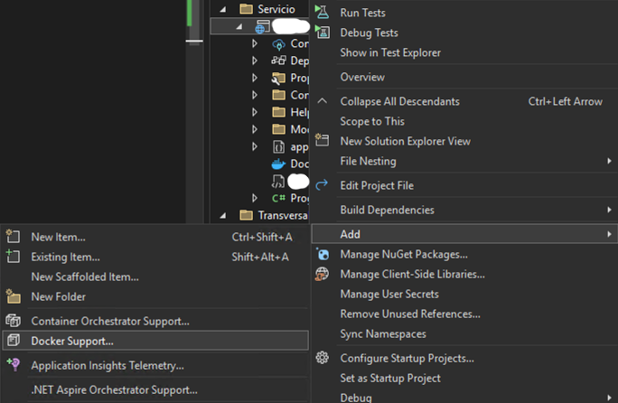

# Automatic .NET ASP.NET Core 7, 8 & 9 tracing to IBM Instana using Opentelemetry
{: .no_toc }

Technical guide step-by-step on how to configure automatic Opentelemetry tracing for your ASP.NET Core 7, 8 & 9 application, configure the Opentelemetry collector to send the application traces to Instana. The approach is using Docker containers running on Windows.

With some slight changes, it should work for other implementations.
{: .fs-6 .fw-300 }

Official documentation

[From IBM Instana](https://www.ibm.com/docs/en/instana-observability/1.0.298?topic=opentelemetry-sending-data-instana){: .btn .btn-primary .fs-5 .mb-4 .mb-md-0 .mr-2 }

<details open markdown="block">
  <summary>
    Table of contents
  </summary>
  {: .text-delta }
1. TOC
{:toc}
</details>

---

## IBM Instana Opentelemetry for Windows

I have read the Instana documentation and there is no clear information on how to do this automatically without any custom tracing or decipher a demo, that can be done in the future but you need something to start with and analyze what is happening inside your .NET application fast.

{: .warning }
> There is an example here for [Monitoring .NET applications](https://www.ibm.com/docs/en/instana-observability/1.0.298?topic=opentelemetry-monitoring-dotnet-applications-from-demo-instana) using Instana but it's a DEMO and not something you can replicate right away for your application.

{: .important }
> This guide is going to show you how to setup your environment to send Opentelemetry traces using the Instana Agent or directly to the Instana backend (without Instana Agent).


## Before setting up everything you need

{: .warning }
> Remember this when enabling any monitoring, either using SaaS or Self-hosted, keep in mind that this is going to increase your ingestion and perhaps your SaaS entitlement (Fair Use Policy) or your Self-hosted resources like storage and CPU/MEM, proceed with caution.

## Ingredients

* Your .NET application and the guide assumes that you know what you're doing with your application.
* Instana Agent (if you want this approach, recommended).
* Opentelemetry collector.

## .NET Core application

To use the .NET Opentelemetry auto-instrumentation is quite simple, there is a lot of text [at the official documentation](https://github.com/open-telemetry/opentelemetry-dotnet-instrumentation) but I'll show you the fastest way, you can always read the official documentation in case something doesn't make sense here.

I'm using the Docker way for the application, you need to "dockerize" the app, I did that by creating a `Dockerfile` for my "Service->ApplicationName.Services.WebApi"


By doing a right click on the `ApplicationName.Services.WebApi` and selecting "Add->Docker Support"



We leave the defaults, click OK and then we are going to have a Dockerfile in the Solution:


Inside the `Dockerfile` we need to add the Opentelemetry instrumentation, just add it after the `ENV ASPNETCORE_URLS=http://+:80` line, as an example this is what I had for my app before adding the Opentelemetry support:

```yaml
#See https://aka.ms/customizecontainer to learn how to customize your debug container and how Visual Studio uses this Dockerfile to build your images for faster debugging.

FROM mcr.microsoft.com/dotnet/aspnet:8.0 AS base
# USER app
WORKDIR /app
EXPOSE 80
ENV ASPNETCORE_URLS=http://+:80

FROM mcr.microsoft.com/dotnet/sdk:8.0 AS build
ARG BUILD_CONFIGURATION=Release
Bunchload of information...
...
```

After "injecting" the lines for Opentelemetry:

```yaml
#See https://aka.ms/customizecontainer to learn how to customize your debug container and how Visual Studio uses this Dockerfile to build your images for faster debugging.

FROM mcr.microsoft.com/dotnet/aspnet:8.0 AS base
# USER app
WORKDIR /app
EXPOSE 80
ENV ASPNETCORE_URLS=http://+:80

# Install OpenTelemetry .NET Automatic Instrumentation
RUN apt-get -y update; apt-get -y install curl

ARG OTEL_VERSION=1.11.0

ADD https://github.com/open-telemetry/opentelemetry-dotnet-instrumentation/releases/download/v${OTEL_VERSION}/otel-dotnet-auto-install.sh otel-dotnet-auto-install.sh
RUN apt-get update && apt-get install -y unzip && \
    OTEL_DOTNET_AUTO_HOME="/otel-dotnet-auto" sh otel-dotnet-auto-install.sh

FROM mcr.microsoft.com/dotnet/sdk:8.0 AS build
ARG BUILD_CONFIGURATION=Release
Bunchload of information...
...
```

Now we create a `docker-compose.yml` and an `otel-dotnet.env` file in the root of your project where the Application sln file is located:


The important part inside the `docker-compose.yml` file is to have Opentelemetry, something similar as the following YAML configuration:

```yaml
services:
  app:
    build:
      context: .
      dockerfile: src/ApplicationName.Services.WebApi/Dockerfile
    env_file:
      - otel-dotnet.env
    environment:
      # OpenTelemetry environment variables:
      OTEL_SERVICE_NAME: "application.name.webapi"
      # I'm using this because I have the Opentelemetry collector running as docker container in the same host.
      OTEL_EXPORTER_OTLP_ENDPOINT: http://host.docker.internal:4318
```

Inside the `otel-dotnet.env` file you need to have the following, as is, don't tweak it:

```yaml
# enable OpenTelemetry .NET Automatic Instrumentation
CORECLR_ENABLE_PROFILING="1"
CORECLR_PROFILER='{918728DD-259F-4A6A-AC2B-B85E1B658318}'
CORECLR_PROFILER_PATH="/otel-dotnet-auto/linux-x64/OpenTelemetry.AutoInstrumentation.Native.so"
DOTNET_ADDITIONAL_DEPS="/otel-dotnet-auto/AdditionalDeps"
DOTNET_SHARED_STORE="/otel-dotnet-auto/store"
DOTNET_STARTUP_HOOKS="/otel-dotnet-auto/net/OpenTelemetry.AutoInstrumentation.StartupHook.dll"
OTEL_DOTNET_AUTO_HOME="/otel-dotnet-auto"
```

And that's it, your application is ready to be containerized.

## Windows Instana agent

This is the recommended way to do things, because the Instana agent is going to aggregate more metadata to your traces and you're going to need as much information as you need when troubleshooting, just install the agent as instructed in [the official documentation](https://www.ibm.com/docs/en/instana-observability/current?topic=agents-installing-windows).

## Opentelemetry Collector

For testing purposes, I created a Docker container for the Opentelemetry Collector to work with Instana, in case you're using SaaS please refer to [this documentation](https://www.ibm.com/docs/en/instana-observability/1.0.298?topic=instana-backend#endpoints-of-the-instana-backend-otlp-acceptor) or if you're using self-hosted refer to [this documentation](https://www.ibm.com/docs/en/instana-observability/1.0.298?topic=instana-backend#configuring-self-hosted-instana).

For this environment, I'm using Instana SaaS and this is the `docker-compose.yml` file for my Opentelemetry collector, just change it based on your needs:

```yaml
version: '3.9'

services:
  # OpenTelemetry Collector
  otel-collector:
    image: otel/opentelemetry-collector-contrib:0.116.1
    volumes:
      - ./otel-collector/otel-config.yaml:/etc/otel/config.yaml
      - ./log:/log/otel
    command: --config /etc/otel/config.yaml
    environment:
      INSTANA_GRPC_ENDPOINT: "otlp-red-saas.instana.io:4317"
      INSTANA_HTTP_ENDPOINT: "https://otlp-red-saas.instana.io:4318"
      # Instana Agent KEY
      INSTANA_KEY: "AGENT_KEY"
      INSTANA_HOST: "yourawesomehost"
    ports:
      - "13133:13133" # health_check extension
      - "55679:55679" # ZPages extension
      - "4318:4318"   # OTLP Receiver protocol HTTP
      - "4317:4317"   # OTLP Receiver protocol gRPC
```

Again, for my testing purposes, I have my `otel-config.yaml` file like this:

```yaml
extensions:
  health_check:
  zpages:
    endpoint: 0.0.0.0:55679

receivers:
  otlp:
    protocols:
      grpc:
        endpoint: 0.0.0.0:4317
      http:
        endpoint: 0.0.0.0:4318

processors:
  batch:
    timeout: 10s

exporters:
  debug:
    # logLevel: debug
    verbosity: detailed
  file/traces:
    path: /log/otel/traces.log
  file/metrics:
    path: /log/otel/metrics.log
  file/logs:
    path: /log/otel/logs.log

# Instana using the agent
  otlp/instanaAgent:
    endpoint: host.docker.internal:4317
    tls:
      insecure: true

# Instana using backend gRPC
#  otlp:
#    endpoint: "${INSTANA_GRPC_ENDPOINT}"
#    tls:
#      insecure: true
#    headers:
#      x-instana-key: "${INSTANA_KEY}"
#      x-instana-host: "${INSTANA_HOST}"

# Instana using the backend HTTP
#  otlphttp:
#    endpoint: "${INSTANA_HTTP_ENDPOINT}"
#    headers:
#      x-instana-key: "${INSTANA_KEY}"
#      x-instana-host: "${INSTANA_HOST}"

service:
  pipelines:
    traces:
      receivers:
        - otlp
      processors: [batch]
      exporters:
        - debug 
        - file/traces
#        - otlp
#        - otlphttp
        - otlp/instanaAgent
    metrics:
      receivers:
        - otlp
      processors: [batch]
      exporters:
        - debug 
        - file/metrics
#        - otlp
#        - otlphttp
        - otlp/instanaAgent
    logs:
      receivers:
        - otlp
      processors: [batch]
      exporters:
        - debug 
        - file/logs
#        - otlp
#        - otlphttp
        - otlp/instanaAgent
  extensions:
    - health_check
    - zpages
```

{: .warning }
> As you can see, there are three ways you can send Opentelemetry data to Instana, using the Agent (recommended) and directly to the backend using either HTTP or gRPC. Choose the one you think is best for your business.

Just run the command `docker compose up -d`:

```powershell
PS C:\Users\Administrator\Documents\V10\Backend.Observability.OTelCollector> docker compose up -d
time="2025-06-16T06:14:43-07:00" level=warning msg="C:\\Users\\Administrator\\Documents\\V10\\Backend.Observability.OTelCollector\\docker-compose.yml: the attribute `version` is obsolete, it will be ignored, please remove it to avoid potential confusion"
[+] Running 1/1
 ✔ Container backendobservabilityotelcollector-otel-collector-1  Started
```

Confirm it's running:

```powershell
PS C:\Users\Administrator\Documents\V10\Backend.Observability.OTelCollector> docker ps
CONTAINER ID   IMAGE                                          COMMAND                  CREATED          STATUS          PORTS                                                                                                         NAMES
be2ee6e5d6f9   otel/opentelemetry-collector-contrib:0.116.1   "/otelcol-contrib --…"   31 minutes ago   Up 21 minutes   0.0.0.0:4317-4318->4317-4318/tcp, 0.0.0.0:13133->13133/tcp, 0.0.0.0:55679->55679/tcp, 55678/tcp               backendobservabilityotelcollector-otel-collector-1
```

Now that the Opentelemetry collector is running, it is time to test our application!

Run your application:

```powershell
docker compose up -d
```

## Results!

If eveything went well, go to your Instana UI -> Applications -> Services and search your application, click on it and you should have your dashboard:


## Gotchas with this setup

Since I'm running everything in Windows.

* Need to find a way to change the hostname.
* Need to find a way to monitor the rest of the docker containers.
