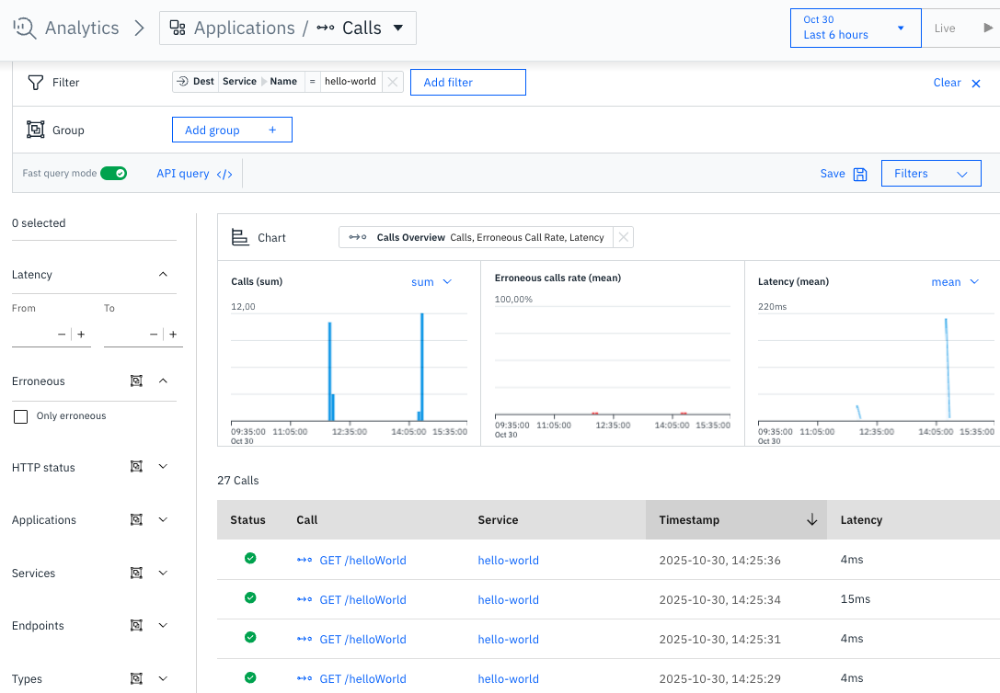
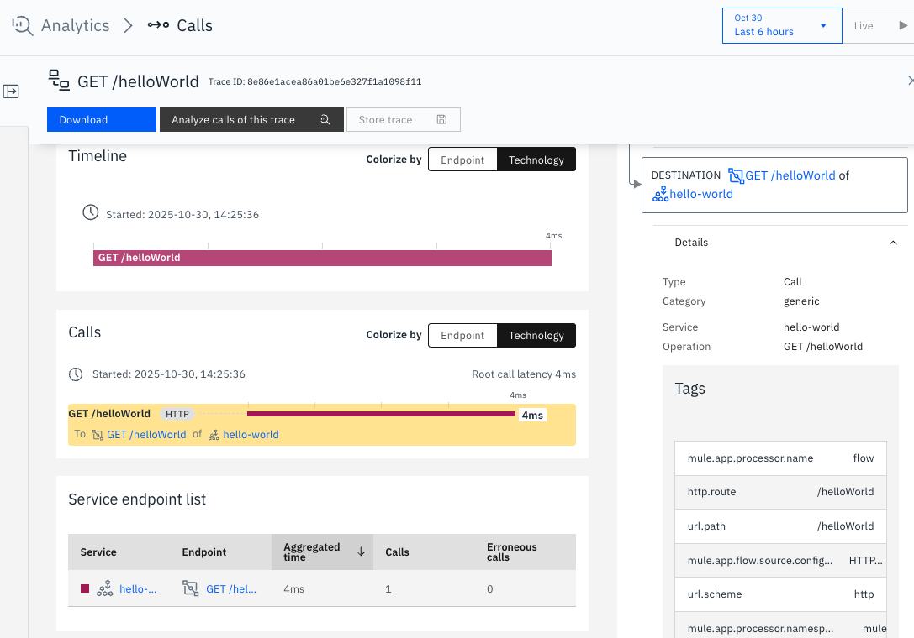
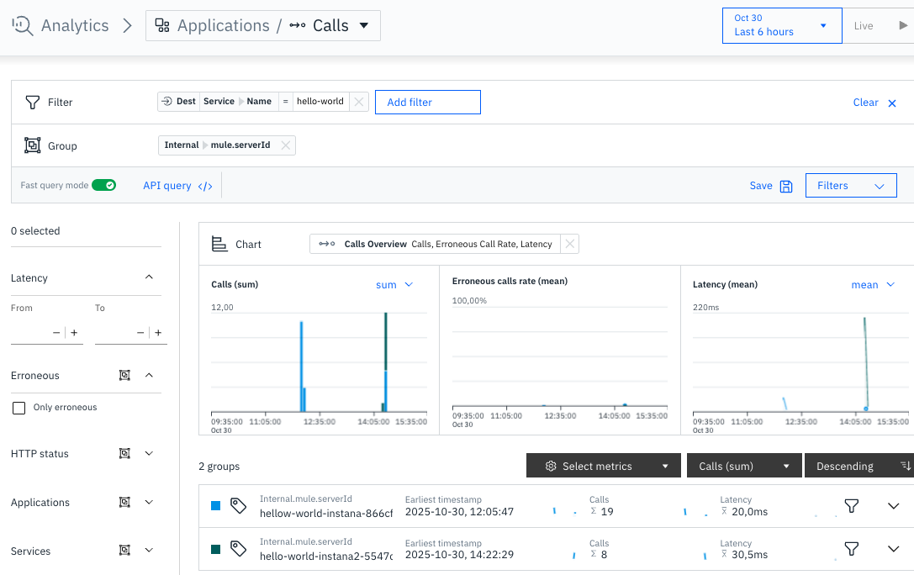

# MuleSoft Anypoint Hello World app with Opentelemetry for IBM Instana
{: .no_toc }

Technical guide step-by-step on how to configure a MuleSoft Anypoint Hello World app with Opentelemetry for IBM Instana using the [Mule Opentelemetry Module](https://github.com/avioconsulting/mule-opentelemetry-module) created by Avio Consulting.

With some slight changes, it should work for other implementations.
{: .fs-6 .fw-300 }

Official documentation

[From Avio Consulting](https://avioconsulting.github.io/mule-opentelemetry-module/){: .btn .btn-primary .fs-5 .mb-4 .mb-md-0 .mr-2 }

  

    Table of contents
  

  {: .text-delta }
1. TOC
{:toc}

---

## Where is the guide?

Updated: 30 October 2025

{: .warning }
> For this one I decided to have it on a Github repo for quick access and updates, I'm going to see how this works.

To the guide!

[README.md](https://github.com/IsReal8a/instana-examples/tree/main/mule-app-hello-world-otel){: .btn .btn-primary .fs-5 .mb-4 .mb-md-0 .mr-2 }

## Preview

