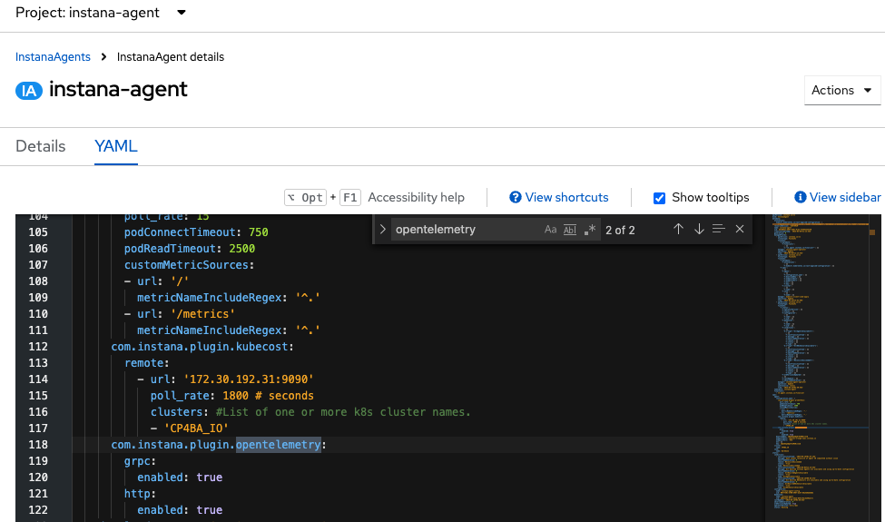
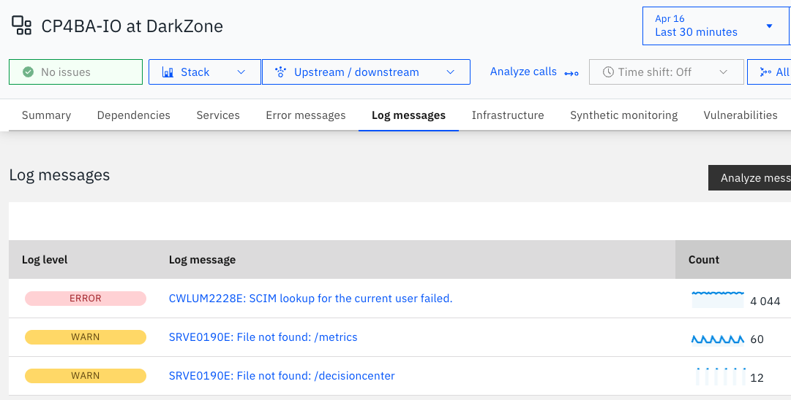
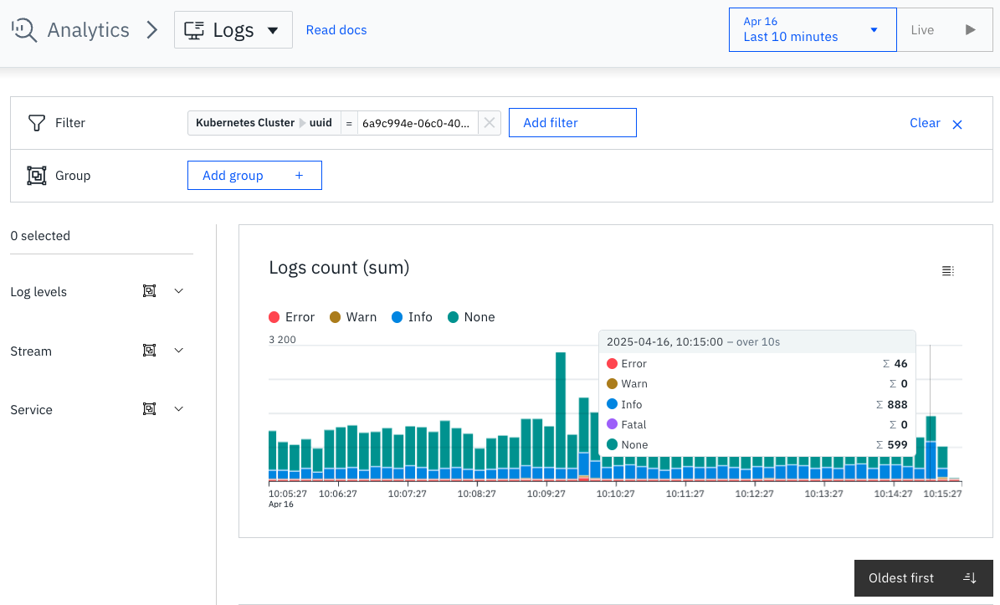
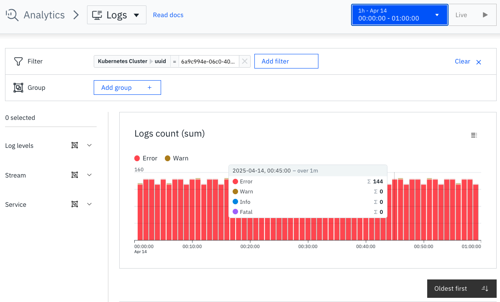

# Send RedHat OpenShift logs to IBM Instana using Opentelemetry
{: .no_toc }

Technical guide step-by-step to enable Opentelemetry in the Instana agent and install the Opentelemetry collector to send logs from OCP to Instana.

With some slight changes, it should work for other implementations.

Update: 17 June 2025
{: .fs-6 .fw-300 }

Official documentation

[From IBM Instana](https://www.ibm.com/docs/en/instana-observability/current?topic=opentelemetry-collecting-kubernetes-red-hat-openshift-logs){: .btn .btn-primary .fs-5 .mb-4 .mb-md-0 .mr-2 }

<details open markdown="block">
  <summary>
    Table of contents
  </summary>
  {: .text-delta }
1. TOC
{:toc}
</details>

---

## IBM Instana Opentelemetry

You can collect metrics, traces and logs using Opentelemetry but since this is quite a new feature, more customers are in the need to enable log ingestion into IBM Instana.

{: .warning }
> It's important to start with reading the [Pre-requisites](https://www.ibm.com/docs/en/instana-observability/current?topic=opentelemetry-prerequisites) to know what's needed.

{: .warning }
> If you land in another page in the IBM Instana Opentelemetry documentation it makes difficult to understand the process on how to setup everything to make it work properly.
> That's why you need to know that this guide covers the steps needed to have this setup up and running, I'm going to use the official documentation just as reference.

{: .warning }
> Read this guide first completely and carefully before implementation.

## Before enabling and setting up this feature

{: .warning }
> Please note that logs, by nature, depending how you setup your environment, can be noisy and thus cause a huge impact in the ingress to your Instana backend. You need to pay special attention for SaaS since this will increase the payment per month and Self-hosted because you'll need more infrastructure resources. Plan ahead.

## Enabling the IBM Instana Logs feature

{: .important }
> At the time of writing this guide, you need to ask your IBM representative to enable the feature in SaaS.

For self-hosted, you need to run the following command for the Standard edition:

```shell
stanctl backend apply --core-feature-flags feature.logging.enabled=true
```

More information can be found in

[IBM Instana Logging](https://www.ibm.com/docs/en/instana-observability/current?topic=configuring-enabling-optional-features#logging){: .btn }


## Setup IBM Instana agent and Opentelemetry in RedHat OpenShift Platform

Steps to have the Logs from RedHat OpenShift being ingested by IBM Instana:

* Setup the Instana agent for Opentelemetry.
* Setup the Opentelemetry collector to send data to the Instana agent.

In this guide, all that will be done in the same RedHat OpenShift cluster.

### Configure the IBM Instana agent for Opentelemetry support

{: .important }
> Instana agent HELM approach was used in this guide.

You can read the official documentation on how to setup the

[Instana agent configuration](https://www.ibm.com/docs/en/instana-observability/current?topic=instana-agent){: .btn }

However, TLDR; not that much time and we need to make this fast, you have the short version below.

Just update (or create) your Instana agent `configuration.yaml` file, below you have an example on how to setup Opentelemetry:

```yaml
apiVersion: instana.io/v1
kind: InstanaAgent
metadata:
  name: instana-agent
  namespace: instana-agent
spec:
  zone:
    name: DarkZone # (optional) name of the zone of the host
  cluster:
      name: CP4BA_IO
  agent:
    key: AGENT_KEY
    downloadKey: DOWNLOAD_KEY
    endpointHost: ingress-orange-saas.instana.io
    endpointPort: "443"
    env: {}
    configuration_yaml: |
      com.instana.plugin.opentelemetry:
        grpc:
          enabled: true
        http:
          enabled: true
      com.instana.plugin.prometheus:
        poll_rate: 15
        podConnectTimeout: 750
        podReadTimeout: 2500
        customMetricSources:
        - url: '/'
          metricNameIncludeRegex: '^.'
        - url: '/metrics'
          metricNameIncludeRegex: '^.'
      com.instana.plugin.kubecost:
        remote:
          - url: '172.30.192.31:9090'
            poll_rate: 1800 # seconds
            clusters: #List of one or more k8s cluster names.
            - 'CP4BA_IO'
```
Copy-paste until the Opentelemetry part (ignore Prometheus and Kubecost), save it as `instana-agent-cr.yaml` and apply it to your cluster:

```shell
kubectl apply -f instana-agent-cr.yaml
```

That's it, if everything went well you should have the definition in the `instana-agent` instance from the `InstanaAgent` CRD:



### Configure the Opentelemetry collector

You need to have this collector up and running before seeing anything related to Opentelemetry in the Instana UI.

The steps are:

Install the `cert-manager` if you haven't already:

```shell
kubectl apply -f https://github.com/cert-manager/cert-manager/releases/download/v1.16.1/cert-manager.yaml
```

Install the Opentelemetry operator:

```shell
kubectl apply -f https://github.com/open-telemetry/opentelemetry-operator/releases/latest/download/opentelemetry-operator.yaml
```

Pre-reset your Opentelemetry collector, keep a note about the `metadata.name` value because you're going to use it in the next step, for me it became `ocp-otelcol-collector`. Copy-paste the yaml below into a file, for example `otel-collector-config.yaml`, change the values you need but pretty much it will work like this and save it:

```yaml
apiVersion: opentelemetry.io/v1beta1

kind: OpenTelemetryCollector

metadata:
  ## Users should set this name as needed
  name: ocp-otelcol

spec:
  ## [REQUIRED] Grants the OTEL Collector necessary privileges to access kubernetes log files.
  securityContext: { privileged: true }

  ## [REQUIRED] Best configuration for the `filelog` receiver.
  mode: daemonset

  ## [REQUIRED] We assume minimum OTEL Collector Contrib release v0.110.0 in this documentation.
  image: otel/opentelemetry-collector-contrib:0.110.0
  imagePullPolicy: IfNotPresent

  ## [REQUIRED] It is necessary to specify the mounts that provide the OTEL Collector with access to the pod log files.
  volumeMounts:
    - name: varlogpods
      mountPath: /var/log/pods
      readOnly: true
  volumes:
    - name: varlogpods
      hostPath:
        path: /var/log/pods

  config:
    receivers:
      ## [REQUIRED] The filelog receiver will collect logs written to file by Kubernetes.
      filelog:
        ## [REQUIRED] Standard location for cluster pod log files.
        include: [ /var/log/pods/*/*/*.log ]

        ## [OPTIONAL] Path (or regex) to the log files that must be ignored.
        ## Note: This could be the OTEL Collector pod log located at:
        ##      /var/log/pods/{"opentelemetry collector namespace"}_{"opentelemetry collector fullname"}*_*/{"opentelemetry collector lowercase_chartname"}/*.log
        # exclude: [ "/path/to/log/files/to/ignore" ]

        ## [REQUIRED] Whether to include the file path in the logs
        include_file_path: true

        ## [OPTIONAL] Whether to include the file name in the logs
        include_file_name: true

        ## [OPTIONAL] Preserve the leading white spaces so that the example 'recombine' operator works as expected.
        preserve_leading_whitespaces: true

        operators:
          ## [REQUIRED] Container log parser.
          - type: container
            id: container-parser

          ## [OPTIONAL] Example recombine operator config to handle multi-line log messages for stack-traces. Requires `include_file_path: true` above.
          - type: recombine
            combine_field: body
            is_first_entry: body matches "^[^\\s]"
            source_identifier: attributes["log.file.path"]

    processors:
      ## [REQUIRED] The k8sattributes processor provides UIDs needed to correlate container/pod logs to their corresponding entities.
      ## Note: The following configures collection of the `container.id` and `k8s.pod.uid` fields in the `k8sattributes` processor for correlation.
      ## Note: In some cases, the `container.id` field cannot be provided by the OpenTelemetry SDK, which means Instana will fallback on the `k8s.pod.uid`.
      k8sattributes:
        passthrough: false
        pod_association:
        - sources:
          - from: resource_attribute
            name: container.id
        - sources:
          - from: resource_attribute
            name: k8s.pod.ip
        - sources:
          - from: resource_attribute
            name: k8s.pod.uid
        - sources:
          - from: connection
        extract:
          ## [REQUIRED] At minimum we need the following metadata fields extracted by the `k8sattributes` processor.
          metadata:
            - "k8s.pod.uid"   ## If container.id is unavailable, logs are correlated to a specific Kubernetes pod.
            - "container.id"  ## If this field is available, logs are correlated to specific containers in a Kubernetes pod.
          ## [OPTIONAL] Useful if you want to collect pod labels and send them to Instana as "custom-tags". See the "transform/copy-from-resourcelog" processor below.
          labels:
            - tag_name: $$1
              key_regex: (.*)
              from: pod
          ## [OPTIONAL] Useful if you want to collect pod annotations and send them to Instana as "custom-tags". See the "transform/copy-from-resourcelog" processor below.
          annotations:
            - tag_name: $$1
              key_regex: (.*)
              from: pod

      ## [OPTIONAL] Example OTEL Processor for extracting resource-log attributes collected from pod labels/annotations to be processed as "custom-tags" by Instana
      transform/copy-from-resourcelog:
        log_statements:
          - context: log
            statements:
              ## Example where a pod's start time is collected by the k8sattributes processor.
              - set(attributes["Pod Start Timestamp"], resource.attributes["k8s.pod.start_time"])
              ## Example where a specific field, in this case some `x-forwarder-ip` value is extracted from log messages, using a regex.
              ## Note: Due to the usage of the regex, the entire `set(...)` command is surrounded by single-quotes to avoid YAML parse errors.
              - 'set(attributes["x-forwarder-ip"], ExtractPatterns(body, "x-forwarder-ip: (?P<value>[0-9\\.]+)"))'

      ## [REQUIRED] Resource processor can be manually added to set the `container.runtime` field. Adding this field helps Instana correlate logs to the correct type of Container technology.
      ## Note: In this example, the K8s cluster is running Containerd containers, so the appropriate `container.runtime` attribute is added.
      resource/container_runtime:
        attributes:
        - key: container.runtime
          value: containerd
          action: insert

      ## [OPTIONAL] This is an example log severity parser that sets the **severity_text** field in the log payload, each runs in-order such that the highest matching severity is set.
      ## Note: If the OpenTelemetry Collector does not set log severity, then the severity is set by Instana when analyzing the log message.
      transform/severity_parse:
        log_statements:
        - context: log
          statements:
          - set(severity_text, "Info") where IsMatch(body.string, ".*INFO.*")
          - set(severity_text, "Warn") where IsMatch(body.string, ".*WARN.*")
          - set(severity_text, "Error") where IsMatch(body.string, ".*ERROR.*")
          - set(severity_text, "Fatal") where IsMatch(body.string, ".*FATAL.*")

      ## Logs must be sent in batches for performance reasons.
      ## Note: No additional `batch` processor configuration is provided since configuration depends on the user scenario.
      batch: {}

    exporters:
      ## [REQUIRED] The Instana Agent supports GRPC payloads
      otlp/instanaAgent:
        ## Note: This configuration assumes the Instana Agent is also deployed in the same cluster.
        ## Note: The GRPC port will be 4317 (unless port-forwarding is used to change this).
        endpoint: instana-agent.instana-agent:4317
        ## TLS encryption is disabled in this example.
        tls:
          insecure: true

    service:
      pipelines:
        ## [REQUIRED] Sample logs pipeline using the above configurations.
        logs:
          receivers: [filelog]
          processors: [resource/container_runtime, k8sattributes, transform/severity_parse, batch]
          exporters: [otlp/instanaAgent]
```

Apply the yaml:

```shell
kubectl apply -f otel-collector-config.yaml
```

Apply a "Security Context Constraint" for the Opentelemetry collector, copy-paste and save it as `scc.yaml`.

{: .warning }
> Make sure you change the last line to the name of your Opentelemetry collector name. Following this guide I came up with the name for the `namespace` and the `pod`, those are `default` for the `namespace` and `ocp-otelcol-collector` for the `pod`, note that the prefix `ocp-otelcol` is the name we got from the previous step.

```yaml
apiVersion: security.openshift.io/v1

kind: SecurityContextConstraints

metadata:
  name: otel-scc

allowPrivilegedContainer: true
allowHostDirVolumePlugin: true
allowHostPorts: true

runAsUser:
  type: RunAsAny

seLinuxContext:
  type: RunAsAny

fsGroup:
  type: RunAsAny

users:
## [REQUIRE] Replace `<namespace>:<otel-pod-name>` as needed for your OTEL Collector installation.
## Example: `system:serviceaccount:mynamespace:opentelemetry-collector`
- system:serviceaccount:default:ocp-otelcol-collector
```

Apply it:

```shell
kubectl apply -f scc.yaml
```

It's quite straight-forward, at this point you should not have any issues, if you do, go to the Instana agent logs and troubleshoot.

{: .warning }
> Important, these logs will not be shown in the Platform view, we're going to see the logs for ERROR and WARN only.



To see these logs, you need to go to left hand side menu, click  "Analytics", at the top left next to the Analytics word select "Logs" in the dropdown and filter by Kubernetes Cluster, for example:



The next screenshot is without Opentelemetry logging:



{: .warning }
> You can see the increase in the data ingestion, that's why you need to be mindful on what you need to enable before pushing this configuration to a Production environment.

## Next steps for the writer of this guide

I need to play with the configuration to allow just certain levels, apply transformations for multi-line logs and exclude certain logs to be sent.

But this guide gives you an idea on how you can start your journey and start using the Logs feature.