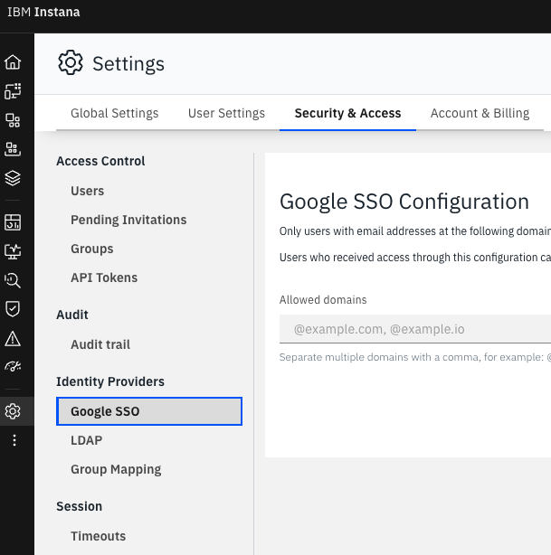
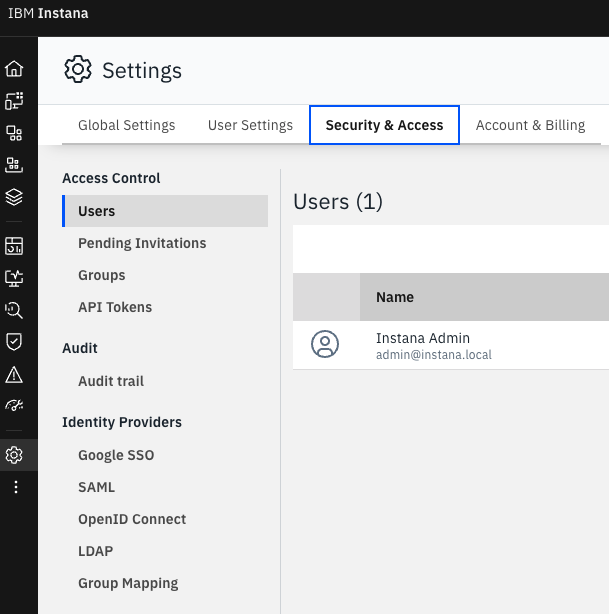

# IBM Instana Self-hosted Standard IdP
{: .no_toc }

Technical guide on how to prepare your IBM Instana Self-hosted Standard backend to be ready to enable authetication using IdPs, this is the first step if you want to have authetication using SAML or OID.
{: .fs-6 .fw-300 }

<details open markdown="block">
  <summary>
    Table of contents
  </summary>
  {: .text-delta }
1. TOC
{:toc}
</details>

---

## Purpose of this guide and pre-requisites

{: .important }
> The purpose is to teach you step-by-step how to prepare your backend to connect Identity Service Providers (IdPs).

{: .warning }
> I'm stitching things together from several places and make it work for Self-hosted Standard, if you see any issue in this guide please contact the Author (About page). As usual, this guide has been tested personally and with customers.
>
> This guide asumes you're using the Instana Self-hosted backend version >= 1.8.0

## IBM Documentation references

All information comes from all these IBM Instana Official documentation references:

[Backend authentication](https://www.ibm.com/docs/en/instana-observability/current?topic=backend-authentication-ldap-configuration){: .btn .btn-purple}

[Configuring Service Provider (SAML)](https://www.ibm.com/docs/en/instana-observability/current?topic=configuration-configuring-service-provider-samloidc){: .btn .btn-purple}

[Configuring Service Provider](https://www.ibm.com/docs/en/instana-observability/current?topic=edition-configuring#configuring-a-service-provider){: .btn .btn-purple}

[Configuring Authentication](https://www.ibm.com/docs/en/instana-observability/current?topic=instana-configuring-authentication){: .btn .btn-purple}


## Do the Group Mapping

It's recommended to read how IdP works as you want to have your Groups mapped before enabling authentication, why? because that's the only authentication method IBM Instana is going to recognize going forward, read the following first:

[IdP Group Mapping](https://www.ibm.com/docs/en/instana-observability/current?topic=authentication-idp-group-mapping){: .btn .btn-green}

## SAML is not enabled in the UI! How can I enabled it?

This is one of the first questions I get from my customers, it's not a hidden standard edition feature, our Instana documentation has the information but this step-by-step guide will make your life easier and faster.

When you login to the IBM Instana UI and go to **Settings-> "Security & Access"** you're NOT going to see SAML or OID, to enable it you need to create an Identity Service Provider key and certificate, and then apply that to the Instana backend.



## Creating an Identity Service Provider key and certificate for IdP configuration

In case you don't have a key and certificate already.

[Documentation Reference](https://www.ibm.com/docs/en/instana-observability/current?topic=configuration-configuring-service-provider-samloidc#creating-service-provider-key-and-certificate-for-idp-configuration){: .btn}

To enable SAML/OID, we need a key and a certificate, you need to run these commands in your Self-hosted Standard host, and save the data in a safe location.

Connect to your IBM Instana backend server.

### Generate a private key

```shell
openssl genrsa -aes128 -out sp_key.pem 2048
```

Example:

```shell
[root@itz idp]# openssl genrsa -aes128 -out sp_key.pem 2048
Enter PEM pass phrase:
Verifying - Enter PEM pass phrase:
[root@itz idp]#
```

{: .warning }
> You are going to be prompted for a passphrase.
>
> Make sure to remember this passphrase since you'll need it later on to provide it as the `key_pass` value.

### Generate a self-signed certificate by using the private key.

```shell
openssl req -new -x509 -key sp_key.pem -out sp_cert.pem -days 365
```

Fill out the CSR (Certificate Signing Request) information as prompted. Make sure to enter the same information that you used when you generated the private key.
I guess the documentation here refers to the Passphrase.

Example:

```shell
[root@itz idp]# openssl req -new -x509 -key sp_key.pem -out sp_cert.pem -days 365
Enter pass phrase for sp_key.pem:
You are about to be asked to enter information that will be incorporated
into your certificate request.
What you are about to enter is what is called a Distinguished Name or a DN.
There are quite a few fields but you can leave some blank
For some fields there will be a default value,
If you enter '.', the field will be left blank.
-----
Country Name (2 letter code) [XX]:SE
State or Province Name (full name) []:Stockholm
Locality Name (eg, city) [Default City]:Stockholm
Organization Name (eg, company) [Default Company Ltd]:IBM
Organizational Unit Name (eg, section) []:CSM
Common Name (eg, your name or your server's hostname) []:
Email Address []:
```

### Combine the certificate and key into one PEM file.

```shell
cat sp_key.pem sp_cert.pem > sp_key_cert.pem
```

{: .warning }
> Make sure to store the `sp_key_cert.pem` file in a safe location.

## Configure a Service Provider in IBM Instana

[Documentation Reference](https://www.ibm.com/docs/en/instana-observability/current?topic=edition-configuring#configuring-a-service-provider){: .btn}

```shell
stanctl backend apply --core-service-provider-password PEMPASSWORD --core-service-provider-pem /path/to/secure/idp/sp_key_cert.pem
```

Example:

```shell
[root@itz idp]# stanctl backend apply --core-service-provider-password MyAwesomeRandomPass --core-service-provider-pem /path/to/secure/idp/sp_key_cert.pem
⠏ Fetching supported Instana versions  [2s] ✓
⠧ Adding Instana Helm repo  [15s] ✓
⠦ Applying backend apps  [39s] ✓
⠋ Waiting for Core/instana-core  [0s] ✓
⠋ Waiting for Unit/instana-unit  [0s] ✓

****************************************************************
* Successfully installed Instana Self-Hosted Standard Edition! *
*                                                              *
* URL: https://itz-instana.ibm.com        *
* Username: admin@instana.local                                *
****************************************************************
```

## Refresh the Instana UI

Refresh the Instana UI or click around and then go to **Settings-> "Security & Access"**, you are going to see the SAML and OpenID options:



## What next?

Don't forget to perfom the IdP Group Mapping first, then you can enable your Service Provider:

[Active Directory](https://www.ibm.com/docs/en/instana-observability/current?topic=authentication-configuring-active-directory){: .btn .btn-purple}
[OKTA](https://www.ibm.com/docs/en/instana-observability/current?topic=authentication-integrating-okta){: .btn .btn-purple}
[OneLogin](https://www.ibm.com/docs/en/instana-observability/current?topic=authentication-integrating-onelogin){: .btn .btn-purple}
[KeyCloak](https://www.ibm.com/docs/en/instana-observability/current?topic=authentication-integrating-keycloak){: .btn .btn-purple}

## What if I can't login with the IdP?

After SAML/OID is activated for your IBM Instana backend, you have no other way to login to Instana.

But fear not, the IdP configuration can be reset

[Documentation reference](https://www.ibm.com/docs/en/instana-observability/current?topic=configuring-modifying-authentication-configuration#resetting-the-idp-configuration){: .btn}

```shell
stanctl auth reset-idp
```

Then you can try to setup the service again.
