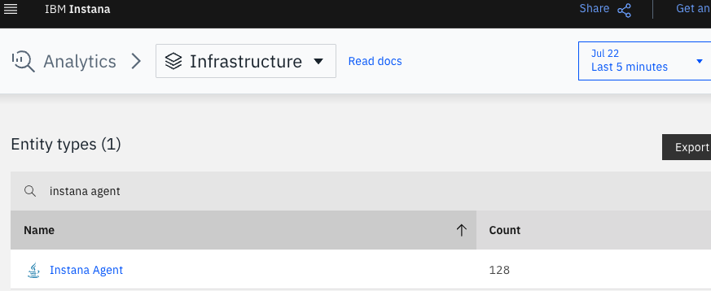
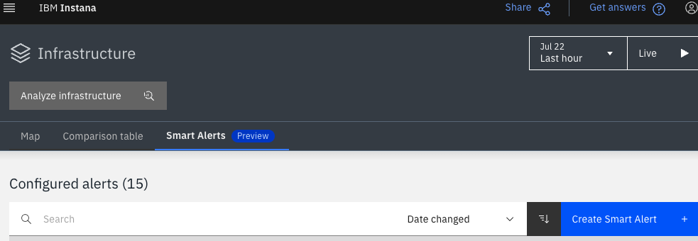
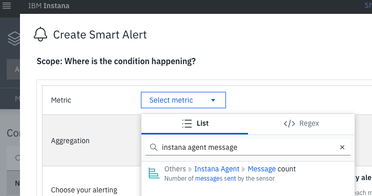
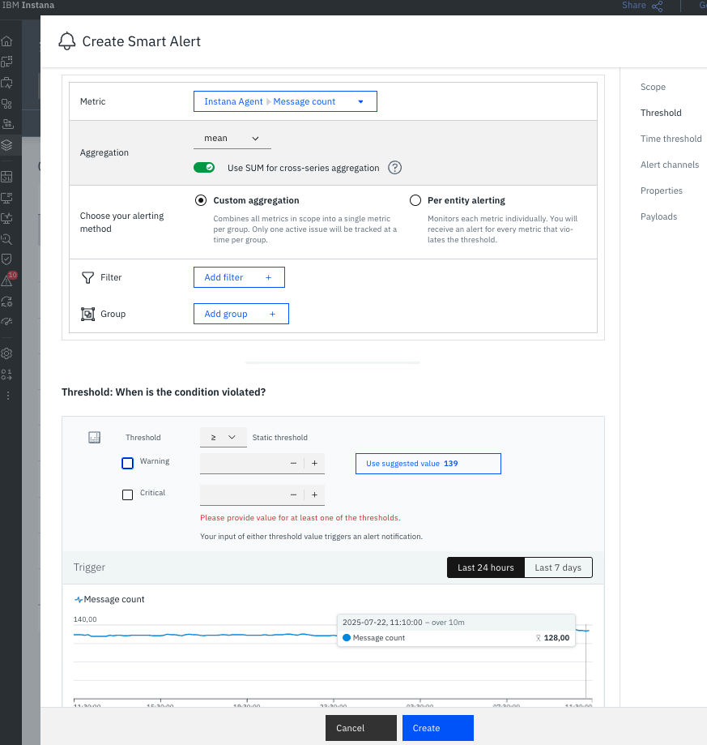

# IBM Instana Agent Smart Alerts
{: .no_toc }

Technical guide on how to create Smart alerts to monitor your Instana Agents.
{: .fs-6 .fw-300 }

  

    Table of contents
  

  {: .text-delta }
1. TOC
{:toc}

---

## Create a Smart alert for Count (Number of reporting Instana Agents)

{: .important }
> This is something that is not straight-forward because Instana is moving away from the classic "Events" to Smart Alerts, for that, the metric count for Instana Agents is not available (yet?). We need another approach to Alert based on that.

### How to get the Instana Agents count

On the menu in the left hand side go to "Analytics", then "Infrastructure", search for "Instana Agent" and you're get the count, make sure you select the last 5 minutes.

You should see something like this:

Now that we know how many Agents we have, we can create our Smart Alert and make sure we match that value.

### Create the Smart Alert

On the menu in the left hand side go to "Infrastructure", click on the "Smart Alerts" tab and then the "Create Smart Alert" button.

On "Select metric" search for "instana agent message" and select the metric.

You may think, but wait, that's the messages, not the agents... fear not, just enable the "Use SUM for cross-series aggregation", that's going to give you the total of Instana agents.

As shown in the screenshot, the value matches what we saw earlier, select your threshold and create the alert based on your environment needs, just make sure to change the Title to something like "Problem on Instana Agents Count".
